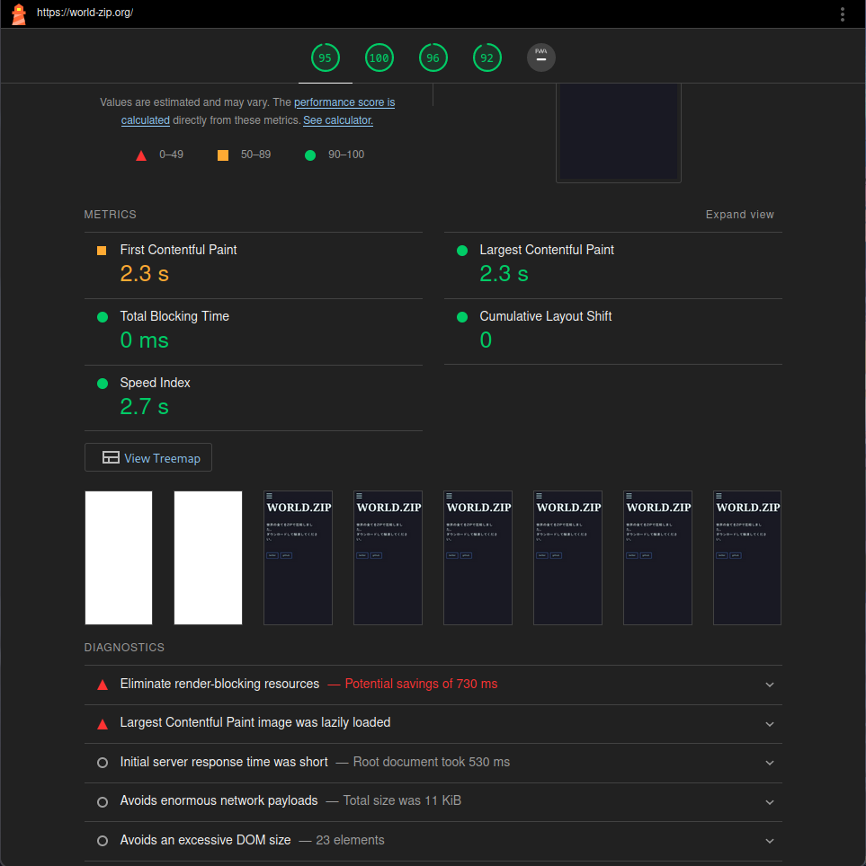
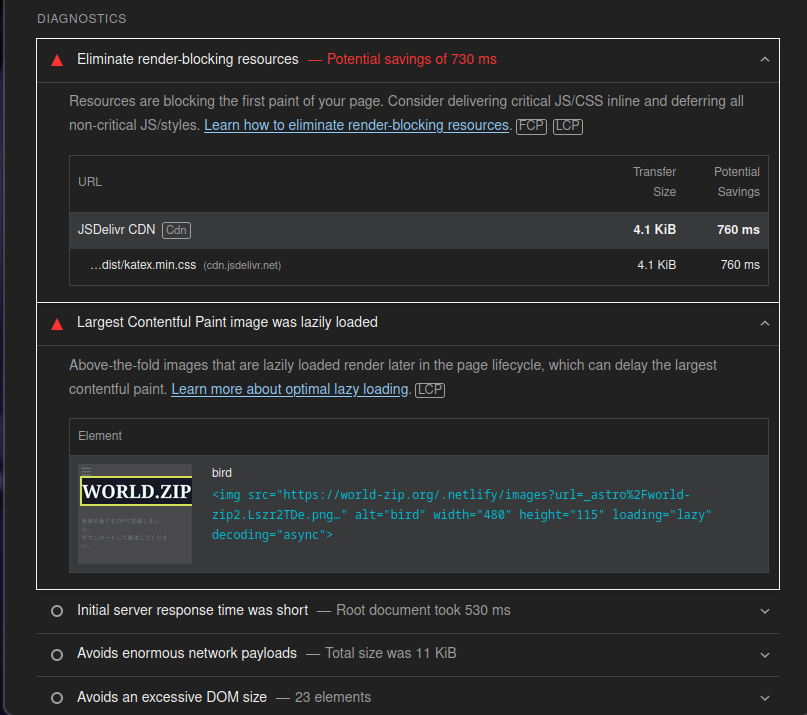

# 個人サイトが遅い？
## Contents
## light houseでの測定
個人サイトがどうも遅い気がするので 
lighthouseで測定してみる。
<!--  -->
<!--  -->


<!--  -->


なるほどなるほど。
リソースがページの最初にロードされているのが遅いということだ。
自分の場合katexのCDNが遅いらしい。
また、遅延読み込みされた画像が上に表示されているのも問題だ。
これはページのライフサイクルの後半にレンダリングされる。
遅延ロードを自身でコントロールする必要がある。

やることは2つ。
1. [レンダリングブロックリソースを排除](https://developer.chrome.com/docs/lighthouse/performance/render-blocking-resources?utm_source=lighthouse&utm_medium=lr&hl=ja)しよう。
2. 画像のサイズを小さくしよう。

<!-- いったいどこから来てるの？ -->
<!---->
<!-- ``` -->
<!-- ~ ❯ sudo traceroute -T sakakibara-blog.netlify.app                             7s -->
<!-- traceroute to sakakibara-blog.netlify.app (18.139.194.139), 30 hops max, 60 byte packets -->
<!--  1  _gateway (192.168.3.1)  0.680 ms  0.695 ms * -->
<!--  2  softbank221110222210.bbtec.net (221.110.222.210)  4.198 ms * * -->
<!--  3  softbank221110222209.bbtec.net (221.110.222.209)  4.276 ms * * -->
<!--  4  * * 10.0.9.93 (10.0.9.93)  5.092 ms -->
<!--  5  * * * -->
<!--  6  softbank221111202118.bbtec.net (221.111.202.118)  5.155 ms * * -->
<!--  7  * * * -->
<!--  8  * * * -->
<!--  9  * * * -->
<!-- 10  * * * -->
<!-- 11  15.230.152.99 (15.230.152.99)  4.592 ms 52.93.66.33 (52.93.66.33)  4.624 ms 15.230.152.139 (15.230.152.139)  5.559 ms -->
<!-- 12  * * * -->
<!-- 13  * * * -->
<!-- 14  * * * -->
<!-- 15  * * * -->
<!-- 16  * * * -->
<!-- 17  * * * -->
<!-- 18  * * * -->
<!-- 19  * * * -->
<!-- 20  ec2-18-139-194-139.ap-southeast-1.compute.amazonaws.com (18.139.194.139)  72.946 ms  72.973 ms  72.683 ms -->
<!-- 21  * * * -->
<!-- 22  ec2-18-139-194-139.ap-southeast-1.compute.amazonaws.com (18.139.194.139)  73.355 ms  73.311 ms  73.399 ms -->
<!-- ``` -->
<!---->
<!-- ??? ap-southeast-1 ?? -->
<!---->
<!-- **シンガポールじゃねぇか！** -->
<!---->
<!-- netlifyではfreeプランではregionを変更することができないらしい。[^1] -->
<!-- そこで、cloudflareに移行することにした。 -->
<!-- ^[1](https://answers.netlify.com/t/changing-deployment-region/25265) -->

<!-- #### cloudflareの移行 -->
<!---->
<!-- #### reference -->
<!-- - [日本国内だとNetlifyよりCloudflare Pageの方が速い!](https://qiita.com/akitkat/items/dcbe4fcaacc051753e2b) -->
