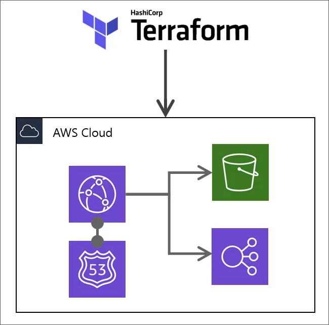
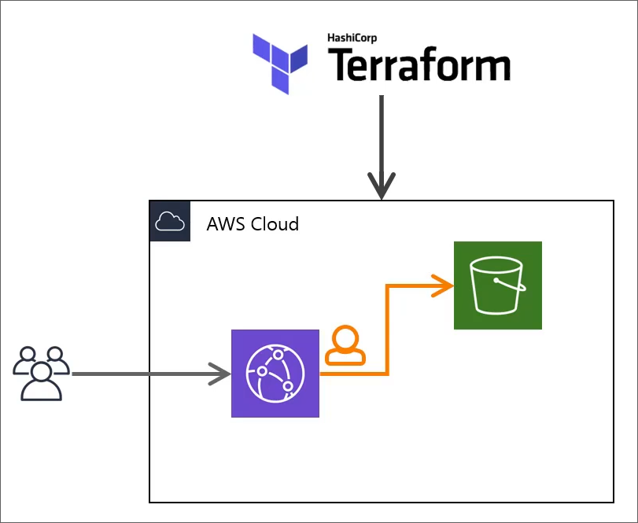
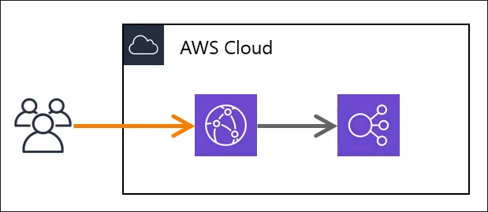
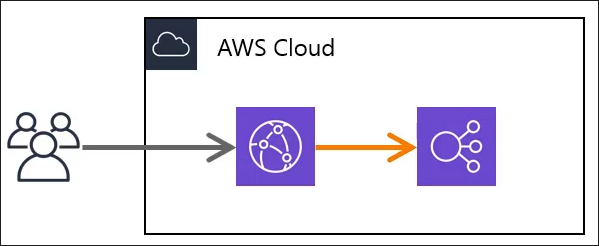
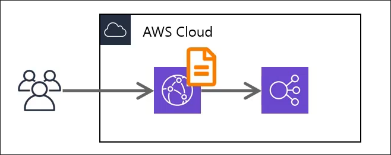
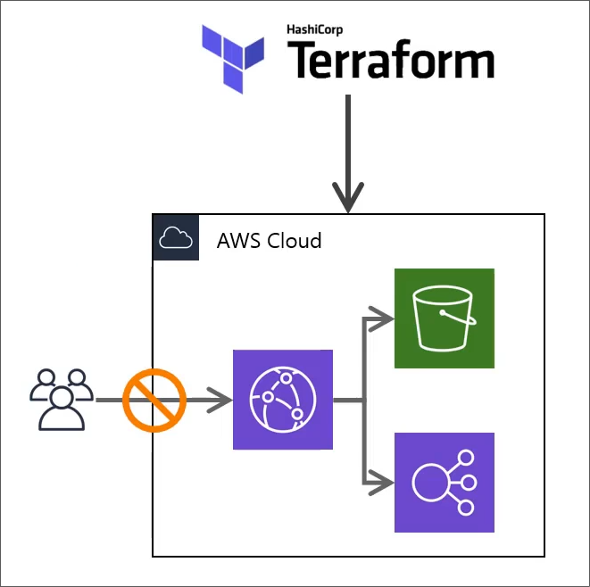
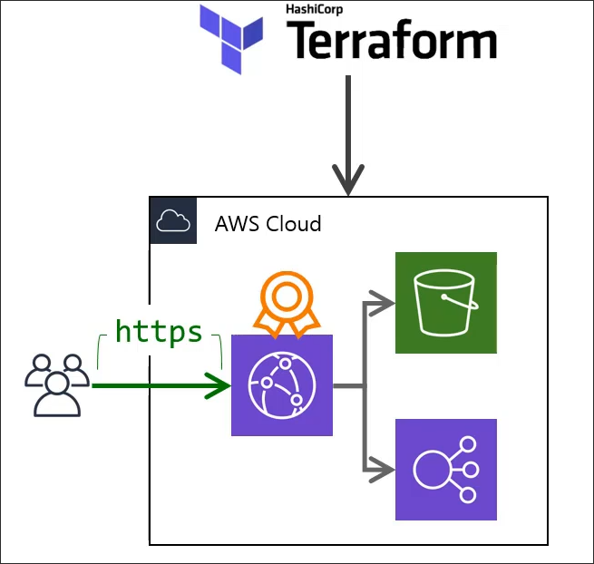
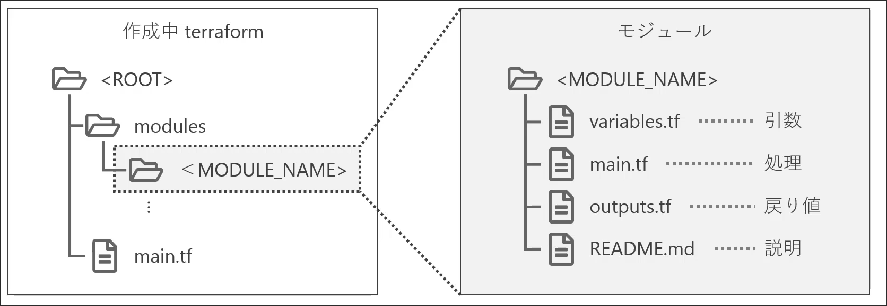

# Introduction
## Contents
## ブロック
terraformのコードはブロックと呼ばれるもので構成される。
```hcl
locals {
  ...
}
variable <VAR_NAME> {
  ...
}
terraform {
  ...
}
provider <PROVIDER_NAME> {
  ...
}
resource <RESOURCE_TYPE> <RESOURCE_NAME> {
  ...
}
output <OUTPUT_NAME> {
  ...
}
```
```
resource <RESOURCE_TYPE> <RESOURCE_NAME> {
  ...
}
```
の`<RESOURCE_TYPE>`は`aws_instance`や`aws_vpc`などのリソースタイプを指す。
`<RESOURCE_NAME>`はリソースの名前を指す。
`<RESOURCE_TYPE>`と`<RESOURCE_NAME>`の組み合わせでterraform内でリソースを一意に識別する。

## ファイル分割
`terraform apply`をすると, 現在のディレクトリにある全ての`.tf`ファイルが読み込まれる。そのため、`terraform apply main.tf`のようにファイル名を指定することは通常無い。

ただし、サブディレクトリにある`.tf`ファイルは自動的に読み込まれない。

```plaintext
.
├── xxx.tf
├── xxx.tf
└── subdir
    ├── xxx.tf
    ├── xxx.tf
    └── xxx.tf
```
## 公式ドキュメントの読み方
terraform関連のドキュメントは見つけにくい.
- HCL2: [Automate Infrastructure on Any Cloud](https://developer.hashicorp.com/terraform?product_intent=terraform)
- CLI: [CLI](https://developer.hashicorp.com/terraform/cli)
- Providers: [Providers](https://registry.terraform.io/browse/providers?product_intent=terraform)
    - Examples
    - Arguments
    - Attribute Reference
の３つのセクションがある。

## 大体のterraform雛形
以下は、[awsのprovider](https://registry.terraform.io/providers/hashicorp/aws/latest/docs)にかかれていたExample・雛形を改造したものである。
```hcl
terraform {
  required_providers {
    aws = {
      source  = "hashicorp/aws"
      version = "~> 5.0"
    }
  }
}

# Configure the AWS Provider
provider "aws" {
  region = "us-east-1"
}

# Create a VPC
resource "aws_vpc" "example" {
  cidr_block = "10.0.0.0/16"
}

variable "project" {
    type    = string
}

variable "environment" {
    type    = string
}
```
特に, 注目すべきは`variable`である。
これは通常のプログラミング言語における変数宣言"var project string"と同じようなものである。

terraformでは変数名を考えることが多いが、これを使うことで統一的に変数名を使うことができる。

この変数については`main.tf`と同じディレクトリに`terraform.tfvars`というファイルを作成し、以下のように記述する。

```plaintext
project = "myproject"
environment = "dev"
```

このように記述することで、
```hcl
Name = "${var.project}-${var.enviroment}-vpc"
Project = var.project
Env = var.enviro
```
のように変数を使うことができる。


具体的なterraformの構成は以下の通り。

- [terraform network](../terraform_network)
- [terraform db](../terraform_db)
- [terraform ec2](../terraform_ec2)
- [terraform management](../terraform_management)
- [terraform iam](../terraform_iam)
- [terraform parameter](../terraform_parameter)
- [terraform app server build](../terraform_app_server_build)
- [terraform grammer](../terraform_grammer)
- [terraform lb](../terraform_lb)
- [terraform route53](../terraform_route53)
- [terraform acm](../terraform_acm)
- [terraform s3](../terraform_s3)

## CloudFront


キャッシュサーバーを世界中に配置することで、ユーザーに近い場所からコンテンツを配信することができる。
なのでオリジンの設定だとか、ドメインの設定だとかが必要になる。

データ構造は次の通りになる。

```d2
CloudFront <- Route53 Record
ACM Certificate <- CloudFront
Origin Access Identity <- CloudFront
Origin Access Identity <- Policy Document

Policy Document : {
    label: Policy Document
    shape: page
}
```

### aws_cloudfront_origin_access_identity
cloudfrontがs3にアクセスする際、どういった権限を持つかを定義するのがaccess identityである。


| 項目 | 型 | 説明 |
| --- | --- | --- |
| comment | string | コメント |

内容はたったこれだけである。

### aws_cloudfront_distribution
cloudfrontの(本体の)設定を行う。
設定内容は以下の通り。
- 基本設定
- オリジン
- ビヘイビア
- アクセス制限
- 証明書

#### 基本設定
| 項目 | 型 | 説明 |
| --- | --- | --- |
| enabled | bool | 有効かどうか |
| is_ipv6_enabled | bool | ipv6を有効にするかどうか |
| comment | string | コメント |
| price_class | enum | "PriceClass_ALL" |
| aliases | string[] | ドメイン名設定 |
| origin | block | オリジンの設定 |
| default_cache_behavior | block | デフォルトのビヘイビア |
| ordered_cache_behavior | block | その他のビヘイビア |
| restrictions | block | アクセス制限 |
| viewer_certificate | block | 証明書設定 |

#### オリジン(origin)
キャッシュサーバーにとってのオリジンサーバーの設定を行う。
ELBをオリジンとするのか、S3をオリジンとするのかを設定する。

| 項目 | 型 | 説明 |
| --- | --- | --- |
| domain_name | string | DNSのドメイン名 |
| origin_id | string | オリジンを識別するユニークな名前 |
| custom_origin_config | string | 独自オリジン(ELB) |
| s3_origin_config | block | s3の設定 |

origin_idはビヘイビアから参照されるため、一意である必要がある。

custom_origin_config
| 項目 | 型 | 説明 |
| --- | --- | --- |
| origin_protocol_policy | enum | "http-only" or "https-only" or "match-viewer" |
| origin_ssl_protocols | string[] | "SSLv3" or "TLSv1" or "TLSv1.1", "TLSv1.2" |
| http_port | number | httpのポート番号 |
| https_port | number | httpsのポート番号 |

s3_origin_config
| 項目 | 型 | 説明 |
| --- | --- | --- |
| origin_access_identity | string | ドメイン名設定 |

#### ビヘイビア(default_cache_behavior, ordered_cache_behavior)

どういうURLを受け付けて、どこへ振り分けるかを設定する。

default_cache_behaviorとordered_cache_behaviorがある。
どちらも似たような設定になる。

どいういうURLを受け付けるかの設定は以下の通り。


| 項目 | 型 | 説明 |
| --- | --- | --- |
| path_pattern | string | パスパターン |
| allowed_methods | string[] | 許可するメソッド |
| cached_methods | string[] | キャッシュするメソッド |
| viewer_protocol_policy | enum | "allow-all" or "redirect-to-https" or "https-only" |

default_cache_behaviorでは、path_patternは不要。

どこへ振り分けるかの設定は以下の通り。


| 項目 | 型 | 説明 |
| --- | --- | --- |
| target_origin_id | string | 転送先のオリジンID |
| forwarded_values | string | 転送するリクエストデータ |

forwarded_values
| 項目 | 型 | 説明 |
| --- | --- | --- |
| query_string | bool | HTTPポート番号 |
| headers | string[] | HTTPSポート番号 |
| cookies | block | "all" or "none" or "whitelist", whitelisted_names |

S3側はキャッシュするが、ELB側はキャッシュしないといった設定ができる。


さらにそのとき、キャッシュするのかといった設定も行う。


| 項目 | 型 | 説明 |
| --- | --- | --- |
| min_ttl | string | 最小キャッシュ期間(秒) |
| default_ttl | string | デフォルトキャッシュ期間(秒) |
| max_ttl | string | 最大キャッシュ期間(秒) |
| compress | bool | 圧縮するかどうか |

### アクセス制限(restrictions)



| 項目 | 型 | 説明 |
| --- | --- | --- |
| geo_restriction | block | 制限する地域 |

geo_restriction
| 項目 | 型 | 説明 |
| --- | --- | --- |
| restriction_type | string | "none" or "whitelist" or "blacklist" |
| locations | string[] | 制限する地域("JP") |

地域毎のアクセス制限を行うことができる。

### 証明書(viewer_certificate)


| 項目 | 型 | 説明 |
| --- | --- | --- |
| cloudfront_default_certificate | bool | CloudFrontのデフォルト証明書を利用するか |
| acm_certificate_arn | string | ACM証明書のARN |
| minimum_protocol_version | enum | "TLSv1", "TLSv1_2016", "TLSv1.1_2016", "TLSv1.2_2019" |
| ssl_support_method | enum | "sni-only" or "vip" |

`cloudfront_deafult_certificate`をtrueにすると、CloudFrontのデフォルト証明書を利用することができる。
`acm_certificate_arn`を指定すると、独自のACM証明書を利用することができる。

sni-onlyは、SNI (Server Name Indication: 1台のサーバーで複数の証明書を利用できる)を利用して証明書を選択する。

## モジュール
リソース生成処理を一つの塊にして呼び出せるようにしたものをモジュールと呼ぶ。
言ってしまえば関数のようなものである。

### モジュールの定義方法
ファイルを以下のように、引数・処理・戻り値・README.mdのように記述するとわかりやすい。


### モジュールの呼び出し方法
`main.tf`では`webserver`モジュールを以下のように呼び出す。
```hcl
module "webserver" {
  source = "./modules/webserver"
  instance_type = "t2.micro"
  ami = "ami-0c55b159cbfafe1f0"
}

// 返り値
output "instance_id" {
  value = module.webserver.instance_id
}
```

## IAM
