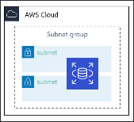
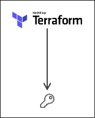
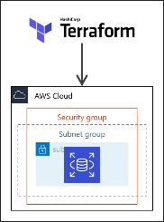
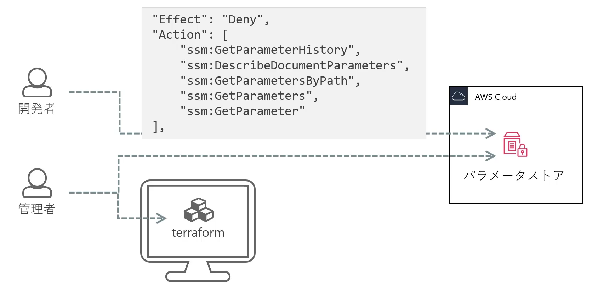
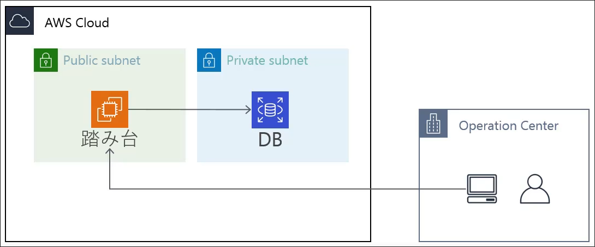

# Introduction
## Contents
## ブロック
terraformのコードはブロックと呼ばれるもので構成される。
```hcl
locals {
  ...
}
variable <VAR_NAME> {
  ...
}
terraform {
  ...
}
provider <PROVIDER_NAME> {
  ...
}
resource <RESOURCE_TYPE> <RESOURCE_NAME> {
  ...
}
output <OUTPUT_NAME> {
  ...
}
```
```
resource <RESOURCE_TYPE> <RESOURCE_NAME> {
  ...
}
```
の`<RESOURCE_TYPE>`は`aws_instance`や`aws_vpc`などのリソースタイプを指す。
`<RESOURCE_NAME>`はリソースの名前を指す。
`<RESOURCE_TYPE>`と`<RESOURCE_NAME>`の組み合わせでterraform内でリソースを一意に識別する。

## ファイル分割
`terraform apply`をすると, 現在のディレクトリにある全ての`.tf`ファイルが読み込まれる。そのため、`terraform apply main.tf`のようにファイル名を指定することは通常無い。

ただし、サブディレクトリにある`.tf`ファイルは自動的に読み込まれない。

```plaintext
.
├── xxx.tf
├── xxx.tf
└── subdir
    ├── xxx.tf
    ├── xxx.tf
    └── xxx.tf
```
## 公式ドキュメントの読み方
terraform関連のドキュメントは見つけにくい.
- HCL2: [Automate Infrastructure on Any Cloud](https://developer.hashicorp.com/terraform?product_intent=terraform)
- CLI: [CLI](https://developer.hashicorp.com/terraform/cli)
- Providers: [Providers](https://registry.terraform.io/browse/providers?product_intent=terraform)
    - Examples
    - Arguments
    - Attribute Reference
の３つのセクションがある。

## 大体のterraform雛形
以下は、[awsのprovider](https://registry.terraform.io/providers/hashicorp/aws/latest/docs)にかかれていたExample・雛形を改造したものである。
```hcl
terraform {
  required_providers {
    aws = {
      source  = "hashicorp/aws"
      version = "~> 5.0"
    }
  }
}

# Configure the AWS Provider
provider "aws" {
  region = "us-east-1"
}

# Create a VPC
resource "aws_vpc" "example" {
  cidr_block = "10.0.0.0/16"
}

variable "project" {
    type    = string
}

variable "environment" {
    type    = string
}
```
特に, 注目すべきは`variable`である。
これは通常のプログラミング言語における変数宣言"var project string"と同じようなものである。

terraformでは変数名を考えることが多いが、これを使うことで統一的に変数名を使うことができる。

この変数については`main.tf`と同じディレクトリに`terraform.tfvars`というファイルを作成し、以下のように記述する。

```plaintext
project = "myproject"
environment = "dev"
```

このように記述することで、
```hcl
Name = "${var.project}-${var.enviroment}-vpc"
Project = var.project
Env = var.enviro
```
のように変数を使うことができる。

## VPCの作成
[公式はここ](https://registry.terraform.io/providers/hashicorp/aws/latest/docs/resources/vpc)
`aws_vpc`はVPCリソースを作成する。

| 項目 | 型 | 説明 |
| --- | --- | --- |
| `cidr_block` | string | IPv4 CIDRブロック |
| `assign_generated_ipv6_cidr_block` | string | IPv6 CIDRブロック |
| `instance_tenancy` | string | テナンシー("default"or "dedicated") |
| `enable_dns_support` | bool | DNS解決の有効化 |
| `enable_dns_hostnames` | bool | DNSホスト名の有効化 |
| `tags` | object | タグ |

### Example
以下は公式ドキュメントに載っている例より項目が多いが, コンソールで作成する場合にはこれらの項目が設定される。
```hcl
resource "aws_vpc" "vpc" {
  cidr_block       = "10.0.0.0/16"
  instance_tenancy = "default"
  enable_dns_support = true
  enable_dns_hostnames = true
  assign_generated_ipv6_cidr_block = false

  tags = {
    Name = "${var.project}-${var.environment}-vpc"
    Project = var.project
    Env = var.environment
  }
}
```

## Subnet
```d2
VPC <- subnet
```

VPCとSubnetは依存関係がある。
今回もVPCと同じようにresourceブロックを使う。
`aws_subnet`はサブネットリソースを作成する。

| 項目 | 型 | 説明 |
| --- | --- | --- |
| `vpc_id` | string | VPCのID |
| `availability_zone` | string | サブネットのアベイラビリティゾーン |
| `cidr_block` | string | IPv4 CIDRブロック |
| `map_public_ip_on_launch` | bool | このサブネットの中でインスタンス起動時にパブリックIPをマッピングするかどうか |
| `tags` | object | タグ |

### Example
public subnet
```hcl
resource "aws_subnet" "public_subnet_1a" {
  vpc_id = aws_vpc.vpc.id
  availability_zone = "ap-northeast-1a"
  cidr_block = "10.0.0.0/20"
  map_public_ip_on_launch = true
  tags = {
    Name = "${var.project}-${var.environment}-public-subnet-1a"
    Project = var.project
    Env = var.environment
    Type = "public"
  }
}
```

private subnet
```hcl
resource "aws_subnet" "private_subnet_1a" {
  vpc_id = aws_vpc.vpc.id
  availability_zone = "ap-northeast-1a"
  cidr_block = "10.0.16.0/20"
  map_public_ip_on_launch = false

  tags = {
    Name = "${var.project}-${var.environment}-public-subnet-1a"
    Project = var.project
    Env = var.environment
    Type = "private"
  }
}
```
ここでは, パブリックサブネットには`map_public_ip_on_launch = true`を設定している。

## ルートテーブルの作成
```d2
VPC <- route table <- route table association -> subnet
```
AWS providerを用いたterraformにおけるルートテーブルの仕組みは少し面倒で、以上のような関係がある。
つまり、単純にルートテーブルを作成するだけでは終わりというわけではなく、ふたつのリソース（route tableとroute table association）を作ってはじめてルートテーブルが有効になる。
どちらもリソースであるため、resourceブロックを使って作成する。

route tableはルートテーブルリソースを提供し、
route table associationはルートテーブルとサブネットの関連付けを提供する。
つまり、route tableという"点"とその点をサブネットという点につなぐ線がroute table associationである。

### route table
| 項目 | 型 | 説明 |
| --- | --- | --- |
| `vpc_id` | string | VPCのID |
| `tags` | object | タグ |


### route table association
| 項目 | 型 | 説明 |
| --- | --- | --- |
| `route_table_id` | string | ルートテーブルID |
| `subnet_id` | string | サブネットID |


### Example
```hcl
resource "aws_route_table" "public_rt" {
  vpc_id = aws_vpc.vpc.id
  tags = {
    Name = "${var.project}-${var.environment}-public-rt"
    Project = var.project
    Env = var.environment
    Type = "public"
    }
}

resource "aws_route_table_association" "public_rt_1a" {
  route_table_id = aws_route_table.public_rt.id
  subnet_id = aws_subnet.public_subnet_1a.id
  }
```

果たしてルーティングの設定ってこれで合ってたっけ？という疑問がある。

なお、ここでは`aws_route`は使用していないことに注意。
`aws_route`はルートテーブルとインターネットゲートウェイの関連付けに使用される。

## インターネットゲートウェイの作成
インターネットゲートウェイに必要な項目・リソースは
`aws_internet_gateway`と`aws_route`である。
```d2
VPC <- internet gateway <- route <- route table
```
| 項目 | 型 | 説明 |
| --- | --- | --- |
| `vpc_id` | string | VPCのID |
| `tags` | object | タグ |


### aws_route
| 項目 | 型 | 説明 |
| --- | --- | --- |
| `route_table_id` | string | ルートテーブルID |
| `destination_cidr_block` | string | ルートの宛先 |
| `gateway_id` | string | インターネットゲートウェイID |

外向き（どこにいくか）にすべての通信を許可したい場合は`destination_cidr_block = 0.0.0.0/0`とする。


#### Example
まずは、インターネットゲートウェイを作成する。
```hcl
resource "aws_internet_gateway" "igw" {
  vpc_id = aws_vpc.vpc.id
  tags = {
    Name = "${var.project}-${var.environment}-igw"
    Project = var.project
    Env = var.environment
  }
}
```
次に、ルートテーブルにルートを追加する。
```hcl
resource "aws_route" "public_rt_igw_r" {
    route_table_id = aws_route_table.public_rt.id
    gateway_id = aws_internet_gateway.igw.id
    destination_cidr_block = "0.0.0.0/0"
}
```

## セキュリティグループの作成

セキュリティグループはインスタンスやリソースに対するアクセス制御を行う。
セキュリティグループは２つのリソースで構成される。
- `aws_security_group` : セキュリティグループリソースを提供
- `aws_security_group_rule`: セキュリティグループのルールを提供
である。

```d2
VPC <- security group <- security group rule
```

### aws_security_group
| 項目 | 型 | 説明 |
| --- | --- | --- |
| `name` | string | セキュリティグループ名 |
| `description` | string | 説明 |
| `vpc_id` | string | VPCのID |
| `tags` | object | タグ |

### aws_security_group_rule
| 項目 | 型 | 説明 |
| --- | --- | --- |
| `security_group_id` | string | セキュリティグループID |
| `type` | enum | ルールのタイプ、`ingress`, `egress` |
| `protocol` | enum | `tcp`, `udp`, `icmp`, etc... |
| `from_port` | number | 開始ポート or 開始ICMPタイプ番号 |
| `to_port` | number | 終了ポート or 終了ICMPタイプ番号 |
| `cidr_blocks` | string[] | CIDRブロック |
| `source_security_group_id` | string | アクセス許可したいセキュリティグループID |

### aws_prefix_list
複数のCIDRブロックをまとめて管理するためのリソースをprefix listという。  
S3などのAWSリソースはDNS名で指定されるが、その裏では複数のIPアドレスが割り当てられている。AWSのマネージドprefix listはAWSリソースのIPアドレス群に名前をつけて管理することができる。

なぜprefix listのような機能が必要なのかというと, DNS名はセキュリティグループのルールやネットワークACLのルールに指定できないためである。
たとえばS3はVPCの外にあるサービスなのでHTTPやHTTPSでアクセスする必要がある。しかし、相手のDNS名をセキュリティグループの宛先に設定できないため、S3へのアクセスを許可するルールは"任意のIPアドレス・80ポートにアクセス"となってしまう。しかし、これはセキュアではない。

また、VPCエンドポイントやVPN接続などのリソースに対してもprefix listを使うことができる。

| 項目 | 型 | 説明 |
| --- | --- | --- |
| `prefix_list_id` | string | プレフィックスリストIDで検索 |
| `name` | string | プレフィックスリスト名で検索 |


## DB運用
RDS全体の構造は以下のようになっている。

```d2
VPC <- DB subnet group
parameter group <- RDS instance
option group <- RDS instance
DB subnet group <- RDS instance
```

### aws_db_parameter_group
parameter groupではRDSで使用されるDBインスタンスのパラメータを設定する。
このパラメータはAWS側で用意されているものを使う。

| 項目 | 型 | 説明 |
| --- | --- | --- |
| `family` | string | パラメータグループファミリ, "mysql8.0", "postgres12", etc.. |
| `parameter` | block | 具体的なパラメータname, value |
| `tags` | object | タグ |

#### Example
今回はRDSのパラメータの`character_set_database`と`character_set_server`をutf8mb4に設定する。

```hcl
resource "aws_db_parameter_group" "mysql_standalone_parametergroup" {
  name   = "${var.project}-${var.environment}-mysql-standalone-parametergroup"
  family = "mysql8.0"

  parameter {
    name  = "character_set_database"
    value = "utf8mb4"
  }

  parameter {
    name  = "character_set_server"
    value = "utf8mb4"
  }
}
```

### オプショングループ
DBインスタンスに追加するオプションを設定するためのリソースである。

| 項目 | 型 | 説明 |
| --- | --- | --- |
| `name` | string | オプショングループ名 |
| `engine_name` | string | エンジン名, `mysql`, `postgres`など |
| `major_engine_version` | string | メジャーエンジンバージョン, "5.7", "8.0"など |
| `option` | block | 個別具体的なオプション名 |
| `tags` | object | タグ |

#### Example
```hcl
resource "aws_db_option_group" "mysql_standalone_optiongroup" {
  name                 = "${var.project}-${var.environment}-mysql-standalone-optiongroup"
  engine_name          = "mysql"
  major_engine_version = "8.0"
}
```

### サブネットグループ
DBが配置されるサブネットを指定するリソースである。
今回は、プライベートサブネットを束ねる形でサブネットグループを作成していく。

| 項目 | 型 | 説明 |
| --- | --- | --- |
| `name` | string | サブネットグループ名 |
| `subnet_ids` | string[] | サブネットID |
| `tags` | object | タグ |



#### Example
```hcl
resource "aws_db_parameter_group" "mysql_standalone_parametergroup" {
  name   = "${var.project}-${var.environment}-mysql-standalone-parametergroup"
  family = "mysql8.0"

  parameter {
    name  = "character_set_database"
    value = "utf8mb4"
  }

  parameter {
    name  = "character_set_server"
    value = "utf8mb4"
  }
}

resource "aws_db_option_group" "mysql_standalone_optiongroup" {
  name                 = "${var.project}-${var.environment}-mysql-standalone-optiongroup"
  engine_name          = "mysql"
  major_engine_version = "8.0"
}

resource "aws_db_subnet_group" "mysql_standalone_subnetgroup" {
  name       = "${var.project}-${var.environment}-mysql-standalone-subnetgroup"
  subnet_ids = [aws_subnet.private_subnet_1a.id, aws_subnet.private_subnet_1c.id]
  tags = {
    Name    = "${var.project}-${var.environment}-mysql-standalone-subnetgroup"
    Project = var.project
    Env     = var.environment
  }
}
```

### ランダム文字列の生成
ランダム文字列を生成するために`hasicorp/random`というproviderを使う。
そのため、`terraform init`を実行してproviderをインストールする必要がある。



| 項目 | 型 | 説明 |
| --- | --- | --- |
| `length` | number | ランダム文字列の長さ(default: true) |
| `upper` | bool | 大文字英字を使うかどうか(default: true)  |
| `lower` | bool | 小文字英字を使うかどうか(default: true)  |
| `number` | bool | 数字を使うかどうか(default: true)  |
| `special` | bool | 特殊文字を使うかどうか(default: true)  |
| `override_special` | string | 利用したい特殊文字 |

## DB instance
DBインスタンスの設定項目は多い。
- 基本設定
- ストレージ
- ネットワーク
- DB設定
- バックアップ
- 削除防止
などなど...

### 基本設定
| 項目 | 型 | 説明 |
| --- | --- | --- |
| 基本設定 | --- | --- |
| `engine` | string | エンジン名 |
| `engine_version` | string | エンジンバージョン |
| `identifier` | string | DBインスタンス名 |
| `instance_class` | string | インスタンスクラス |
| `username` | string | ユーザ名 |
| `password` | string | パスワード |
| `tags` | object | タグ |
| ストレージ | --- | --- |
| `allocated_storage` | number | ストレージ容量 |
| `max_allocated_storage` | number | 最大ストレージ容量 |
| `storage_type` | string | ストレージタイプ |
| `storages_encrypted` | bool | ストレージ暗号化 |
| ネットワーク | --- | --- |
| `multi_az` | bool | マルチAZ |
| `availability_zone` | string | アベイラビリティゾーン |
| `db_subnet_group_name` | string | サブネットグループ名 |
| `vpc_security_group_ids` | string[] | セキュリティグループID |
| `publicly_accessible` | bool | パブリックアクセス |
| `port` | number | ポート番号 |
| DB設定 | --- | --- |
| `name` | string | DB名 |
| `parameter_group_name` | string | パラメータグループ名 |
| `option_group_name` | string | オプショングループ名 |
| `subnet_group_name` | string | サブネットグループ名 |
| バックアップ | --- | --- |
| `backup_window` | string | バックアップウィンドウ |
| `backup_retention_period` | number | バックアップ保持期間 |
| `maintenance_window` | string | メンテナンスウィンドウ |
| `auto_minor_version_upgrade` | bool | マイナーバージョンアップグレード |
| 削除防止 | --- | --- |
| `skip_final_snapshot` | bool | 最終スナップショットをスキップ |
| `deletion_protection` | bool | 削除防止 |
| `apply_immediately` | bool | 即時反映するか |



バックアップでは`backup_window`でいつバックアップを取るかを指定し、`maintenance_window`でいつメンテナンスを行うかを指定している。つまり, `backup_window`が`04:00-05:00`であるなら、`maintenance_window`は`05:00-06:00`のように、バックアップ後にメンテナンスを行うように設定する。

また, `identifier`は**DBインスタンス名**であり、`name`は**DB名**であることに注意する。`identifier`はコンソール上での表示名・識別名であり、`database-1`のような名前が付けられていることが多い。
対して、`name`はDBにアクセスする際の名前であり、`mydb`のような名前が付けられていることが多い。

## RDSのパスワード・パラメータストア
今回、terraformのパスワードは`random_password`を使って生成した。
生成されたパスワードは`terraform.tfstate`ファイルから確認できたが、これにはセキュリティ上の問題がある。
そう。パスワードが平文で保存されているのだ。

この問題の対応方法として、
- RDSのパスワードをDBインスタンスを作成した後に変更する
- 管理者以外がtfstateファイルを見れないようにする。

といった管理がある。それぞれに対して、メリット・デメリットがある。
- tfstateとAWSが一致しなくなるため、パスワードは別管理が必要になる。
- 人の管理をしなければならなくなる。

今回は後者の対応、つまり管理者以外がtfstateファイルを見れないようにすることを行った。



## RDSへのデータ投入
### RDSの踏み台サーバー

コンソールからEC2 > キーペア > キーペアの作成を選択し、キーペアを作成する。
`web-server-gin-dev-keypair`のような名前をつける。
ファイル形式はpem形式とする。

サブネットを`ap-northeast-1a`、セキュリティグループを
- アプリケーション用
- 運用管理用
の2つを選択する。

キーペアは最初に作成したキーペアを選択する。

sshで接続する！

```bash
ssh -i <pemファイル> ec2-user@<public_ip>
```
EC2インスタンス内でMySQLクライアントをインストールする。
[こちら](https://dev.mysql.com/doc/refman/8.4/en/linux-installation-yum-repo.html)を参照！

```bash
sudo yum localinstall mysql80-community-release-el7.noarch.rpm
```
ただし、これだとファイルが存在しない(リポジトリを登録していないので)と言われるので、以下のコマンドを実行する。
以下のコマンドはリポジトリに登録せず、パッケージファイルを直接指定してインストールする方法である。

```bash
sudo dnf -y install https://dev.mysql.com/get/mysql84-community-release-el9-1.noarch.rpm # リポジトリの登録
sudo dnf -y install mysql-community-client # db client の インストール
```

terraform.tfstateファイルからRDSのエンドポイントを取得
```bash
> cat terraform.tfstate | grep -A 100 "aws_db_instance" | grep -E "address|password"

"address": "web-service-gin-dev-mysql-standalone.cymalqtopmzh.ap-northeast-1.rds.amazonaws.com",
"manage_master_user_password": null,
"password": "Mz8z6uZWCGeHMBl0",
```

では、MySQLに接続してみる。

```bash
mysql -h web-service-gin-dev-mysql-standalone.cymalqtopmzh.ap-northeast-1.rds.amazonaws.com -P 3306 -u admin -pMz8z6uZWCGeHMBl0
```
ここで、`p`の後ろにスペースを入れないことに注意する。

すると、MySQLに接続できる。

次に、sqlファイルを`rsync`で踏み台サーバーにコピーする。
```bash
sudo rsync -avz -e "ssh -i ssh/web-server-gin-dev-keypair.pem" sql/data.tar.gz ec2-user@13.231.243.93:/home/ec2-user/
```
ここで、`-e`以降に`ssh`のコマンドを入れる。
また、`ssh`では`ec2-user@<public_ip>`の部分は、`ec2-user@<private_ip>`でも良かったが、なぜか`rsync`では`public_ip`を指定する必要があった。

ec2-userでログインして、tarファイルを解凍する。
```bash
tar -zxvf data.tar.gz
```

ここに格納されていたconfファイルを変更する。
```bash
[client]
user = admin
password = Mz8z6uZWCGeHMBl0
host = web-service-gin-dev-mysql-standalone.cymalqtopmzh.ap-northeast-1.rds.amazonaws.com
port = 3306
```

`10-alter_user`ディレクトリに含まれる以下の`ALTER`文を実行する。
```bash
// alter-user.sql
ALTER USER 'admin'@'%' IDENTIFIED WITH mysql_native_password BY 'Mz8z6uZWCGeHMBl0';
```

```bash
// 10-alter.sh
mysql -defaults-extra-file=../dbaccess.cnf < ./alter-user.sql
```
その他、`20-create_db/create_table.sh`、`30_insert_data/insert_sampledata.sh`を実行する。

終わったら、ECSを削除して、KeyPairを削除する。
また、RDSも停止する。

## ECS APサーバー
## Terraform ステートファイル
