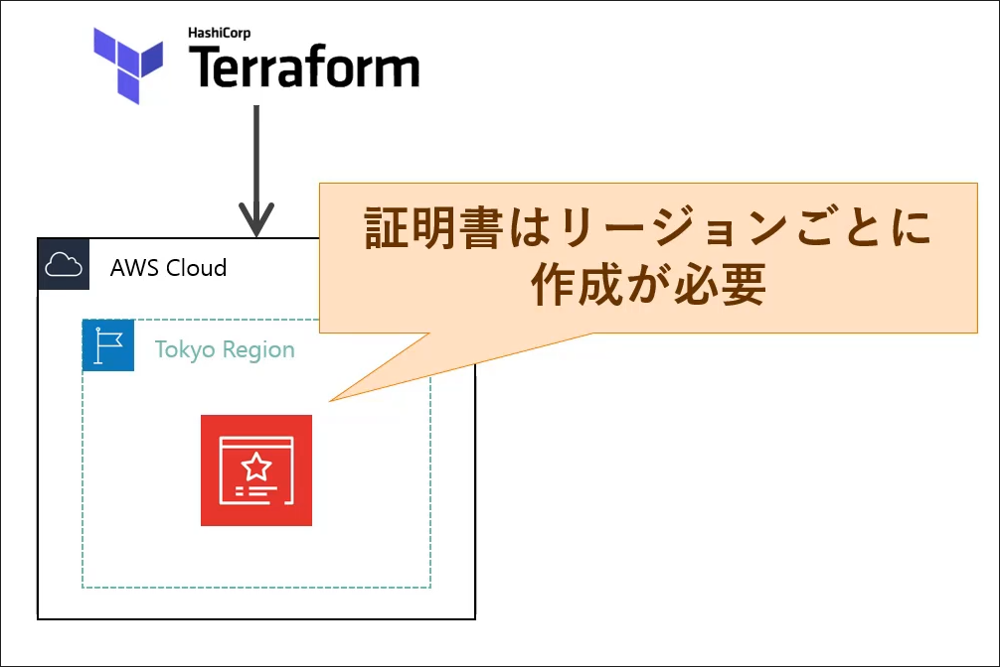
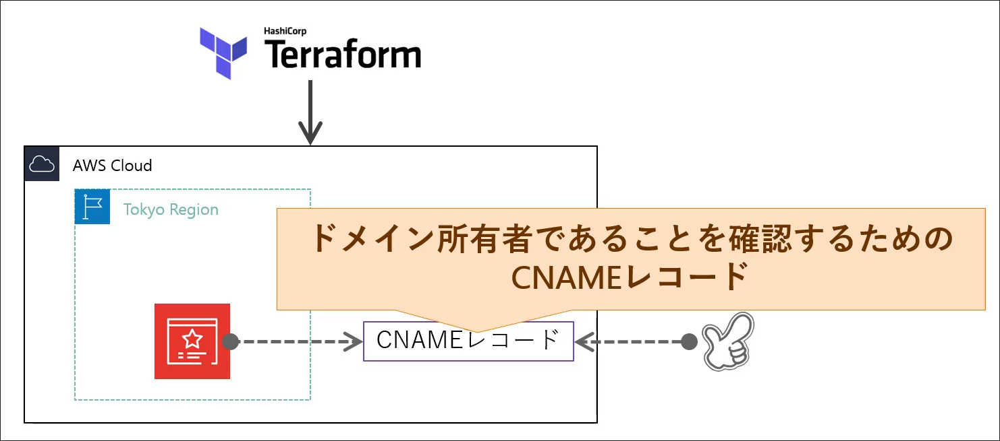
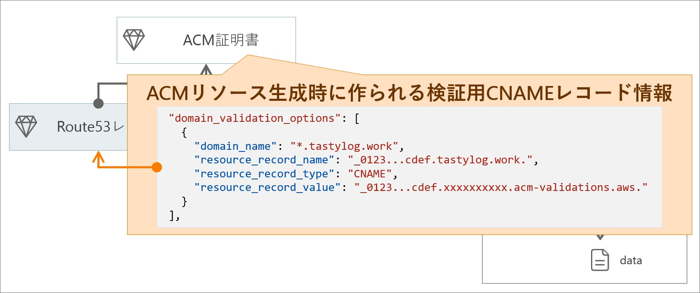

# Introduction
## Contents
## ACM


ACMはAWS Certificate Managerの略で、SSL証明書を発行するサービスである。
この証明書はリージョン毎に作成が必要である。

```d2
ACM Certificate <- Route53 Record
ACM Certificate <- ACM Certification Validation
Route53 Record <- ACM Certification Validation
```

### aws_acm_certificate
| 項目 | 型 | 説明 |
| --- | --- | --- |
| domain_name | string | ドメイン名 |
| validation_method | enum | "DNS", "EMAIL", "NONE" |
| tags | object | タグ |
| lifecycle | string | リソース操作の詳細制御を指定... |

ここで、lifecycleは以下のように指定する。

| 項目 | 型 | 説明 |
| --- | --- | --- |
| create_before_destroy | bool | 削除前に生成を行うか? |

ELBで証明書を利用している場合は
`lifecycle.create_before_destroy = true`の指定が推奨されている。

1. 証明書のリクエスト (ACM): 証明書本体を作成する。
2. DNSの検証設定: そのドメインを所有しているのかを確認する。
  - ACM
  - ドメイン購入先


```hcl
resource "aws_acm_certificate" "tokyo_cert" {
  domain_name       = var.domain
  validation_method = "DNS"
  tags = {
    Name    = "${var.project}-${var.environment}-wildecard-ssl"
    Project = var.project
    Env     = var.environment
  }

  lifecycle {
    create_before_destroy = true
  }

  depends_on = [
    aws_route53_zone.route53_zone
  ]
}
```

なお、ここでは`depends_on`はメタ引数である。

### aws_acm_certificate_validation

ドメインの所有者を確認するためのDNS検証を行う。
Route53のレコードとACMのDNS検証用のリソースを作成する。
ドメイン所有者であることを確認するために、CNAMEレコードを作成する。

DNS検証には
- Route53 Record(Route53 レコード)
- ACM Certification Validation(ACM 証明書検証)

が必要となる。

### aws_route53_record
CNAMEレコードの情報は複雑で、

のようになっている。
`domain_validation_options`はacmが作成された後に取得できるので、メタ引数を使って取得する。

```hcl
resource "aws_route53_record" "route53_acm_dns_resolve" {
  for_each = {
    for dvo in aws_acm_certificate.tokyo_cert.domain_validation_options : dvo.domain_name => {
      name   = dvo.resource_record_name
      type   = dvo.resource_record_type
      record = dvo.resource_record_value
    }
  }

  allow_overwrite = true
  zone_id         = aws_route53_zone.route53_zone.zone_id
  name            = each.value.name
  ttl             = 600
  records         = [each.value.record]
}
```

### aws_acm_certificate_validation
| 項目 | 型 | 説明 |
| --- | --- | --- |
| certificate_arn | string | ACM証明書のARN |
| validation_record_fqdns | string[] | DNS検証に利用するFQDN |

DNSの検証設定(ACM)を行う。
```hcl
resource "aws_acm_certificate_validation" "cert_valid" {
  certificate_arn         = aws_acm_certificate.tokyo_cert.arn
  validation_record_fqdns = [for record in aws_route53_record.route53_acm_dns_resolve : record.fqdn]
}
```

### ELBに証明書を適用
1. ELBにHTTPSリスナーを追加
1. HTTPSにアクセスできるようにする。

これらはロードバランサー(`elb.tf`)の中に実装を行う。

```hcl
resource "aws_lb_listener" "alb_listener_https" {
  load_balancer_arn = aws_lb.alb.arn
  port              = 443
  protocol          = "HTTPS"
  ssl_policy        = "ELBSecurityPolicy-2016-08"
  certificate_arn   = aws_acm_certificate.tokyo_cert.arn

  default_action {
    type             = "forward"
    target_group_arn = aws_lb_target_group.alb_target_group.arn
  }
}
```

