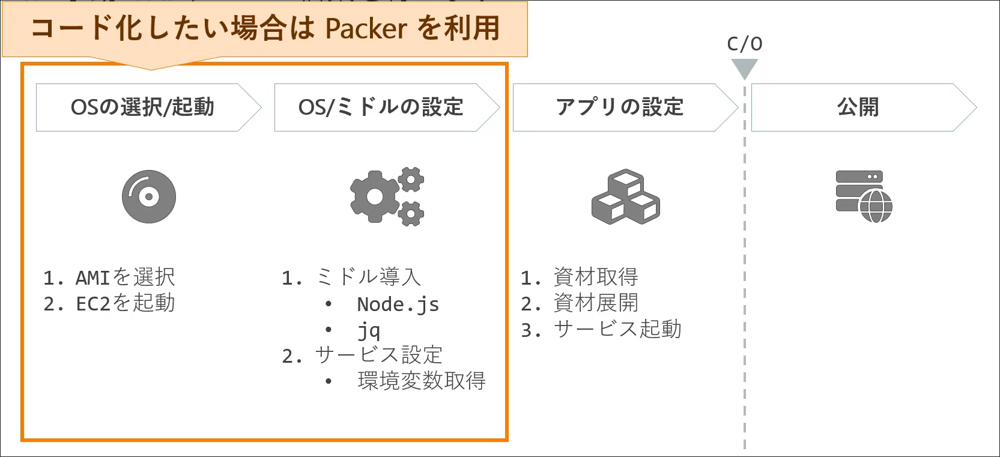

# Introduction
## Contents
## アプリケーションサーバーの構築
アプリケーションの構築は
- OSの選択・起動
- ミドルウェアの設定
- アプリケーションの設定

に工程が分割される。


前２つの工程をIaC化するためにpackerなどを使うことができる。

ミドルウェアの設定は、`install.sh`などのスクリプトを適当に作成して、`web-service-gin.tar.gz`のような適当な名前でアーカイブしておく。
`rsync`で該当のEC2に渡して、`tar -xzvf web-service-gin.tar.gz -C middleware/`で解凍する。

不要なファイルは適宜削除し、
これまでの設定をimageとしてcommitする。

アクション > イメージとテンプレート > イメージを作成
デフォルトでOK.

これでAMIイメージが作成される。

次にアプリケーションの設定を行う。

まず、作成したパッケージ(srcやnode_modulesなどが入っているもの)を`web-service-gin-app.tar.gz`のようにアーカイブしておく。
アーカイブしたものを`rsync`でEC2に転送し、`tar -xzvf web-service-gin-app.tar.gz -C opt/`などで解凍する。
できたら、
```bash
sudo systemctl enable web-service-gin
sudo systemctl start web-service-gin
```

この状態で`176.34.43.147:3000`のようにEC2にパブリックの3000番ポートでアクセスすると、アプリケーションが動作する。

今回使用したもののファイル構成が参考になりそうだったので、以下に記載しておく。
- [web-service-gin middleware](/public/cloud/terraform/tastylog-mw-all-1.0.0.tar.gz)
- [web-service-gin-app](/public/cloud/terraform/tastylog-app-all-1.8.0.tar.gz)

