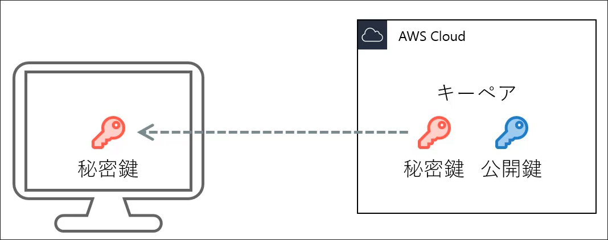
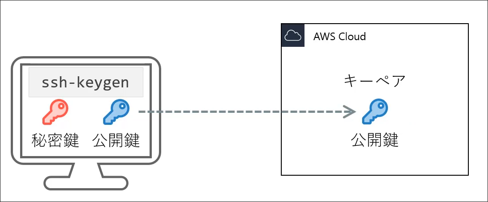

# Introduction
## Contents
## EC2 APサーバー
### AIMの検索
どのAMIを使うかを動的に検索する。

| 項目 | 型 | 説明 |
| --- | --- | --- |
| `owners` | enum[] | 所有者。self(自分自身), amazon, aws-marketplace, microsoft |
| `most_recent` | bool | 最新のイメージを取得するかどうか |
| `executable_users` | string[] | 実行可能なユーザー。self またはアカウントID |
| `filter` | block | name: string, values: string[], それぞれ検索名、検索する値 |

特に、最後の`filter`は`aws ec2 describe-images`コマンドで使われる`--filters`と同じものである。
```bash
aws ec2 describe-images --filters "Name=tag:Name,Values=amazon-ecs-optimized"
```
のように使われる。
`name`と`values`の組み合わせは以下のようなものがある。
| name | 説明 |
| --- | --- |
| name | イメージ名 |
| description | イメージの説明 |
| root-device-type | 接続するブロックストレージの種類。基本は"ebs" |
| virtualization-type | 仮想化方式。基本は"hvm" |

まずは、AWSコンソールからamazon linux2023のAMI IDを調べる。(今回は`ami-023ff3d4ab11b2525`)
調べたAMI IDを元に以下のように検索をかける
。

```bash
aws ec2 describe-images --image-ids ami-023ff3d4ab11b2525
```

```json
{
    "Images": [
        {
            ...
            "Name": "al2023-ami-2023.6.20241121.0-kernel-6.1-x86_64",
            ...
            "RootDeviceType": "ebs",
            ...
            "VirtualizationType": "hvm",
        }
    ]
}
```
今回は`Name`, `RootDeviceType`, `VirtualizationType`を使って検索をかける。

特に、`Name`は`al2023-ami-2023.6.20241121.0-kernel-6.1-x86_64`のように2023.6の後に日付が含まれているのでこれをワイルドカードにすると良い。

```hcl
data "aws_ami" "app" {
  most_recent = true
  owners = ["self", "amazon"]
  filter {
    name = "name"
    values = ["al2023-ami-2023.6.*-kernel-6.1-x86_64"]
  }
  filter {
    name = "root-device-type"
    values = ["ebs"]
  }
  filter {
    name = "virtualization-type"
    values = ["hvm"]
  }
}
```
### キーペアの作成
AWSのコンソール上からキーペアを作成すると、AWSから秘密鍵がダウンロードされる形になる。

対して、terraformでキーペアを作成する場合は、`ssh-keygen`で公開鍵を作成し、それをAWSに登録する形になる。(おそらくこっちがセキュア)



`aws_key_pair`リソースは以下のように使う。
| 項目 | 型 | 説明 |
| --- | --- | --- |
| `key_name` | string | キーペア名 |
| `public_key` | string | 公開鍵 |
| `tags` | object | タグ |

```bash
ssh-keygen -t rsa -b 2048 -f tastylog-dev-keypair
```
で公開鍵を作成する。次にこれをterraformの`aws_key_pair`リソースで登録する。

```hcl
resource "aws_key_pair" "keypair" {
  key_name = "${var.project}-${var.environment}-keypair"
  public_key = file("./ssh/tastylog-dev-keypair.pub")
  tags = {
    Name = "${var.project}-${var.environment}-keypair"
    Project = var.project
    Env = var.environment
  }
}
```
これでキーペアが作成される。
## EC2 instance

これまででEC2の起動に必要なものは全て作成したので、EC2インスタンスを作成する。
```d2
AMI <- EC2
Key Pair <- EC2
Security Group <- EC2
Subnet <- EC2
```
`aws_instance`リソースは以下のように使う。
| 項目 | 型 | 説明 |
| --- | --- | --- |
| 基本設定 | --- | --- |
| `ami` | string | AMI ID |
| `instance_type` | string | インスタンスタイプ, `t2.micro`など |
| `tags` | object | タグ |
| ネットワーク | --- | --- |
| `subnet_id` | string | サブネットID |
| `associate_public_ip_address` | bool | パブリックIPを割り当てるかどうか |
| `vpc_security_group_ids` | string[] | セキュリティグループID |
| その他 | --- | --- |
| `iam_instance_profile` | string | IAMロール |
| `key_name` | string | キーペア名 |
| `user_data` | string | インスタンス起動時に実行するスクリプト |

```hcl
resource "aws_instance" "app_server" {
  ami                         = data.aws_ami.app.id
  instance_type               = "t2.micro"
  subnet_id                   = aws_subnet.public_subnet_1a.id
  associate_public_ip_address = true
  vpc_security_group_ids = [aws_security_group.app_sg.id,
  aws_security_group.opmng_sg.id]
  key_name = aws_key_pair.keypair.key_name
  tags = {
    Name    = "${var.project}-${var.environment}-app-ec2"
    Project = var.project
    Env     = var.environment
    Type    = "app"
  }
}
```
