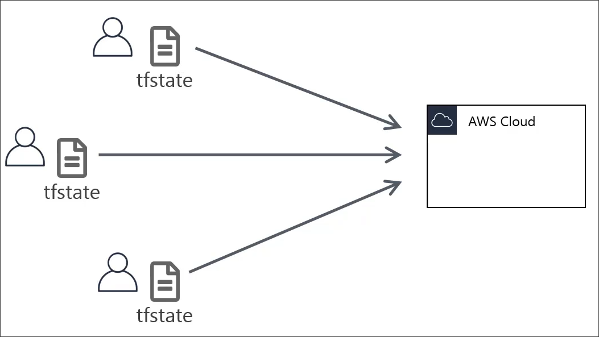
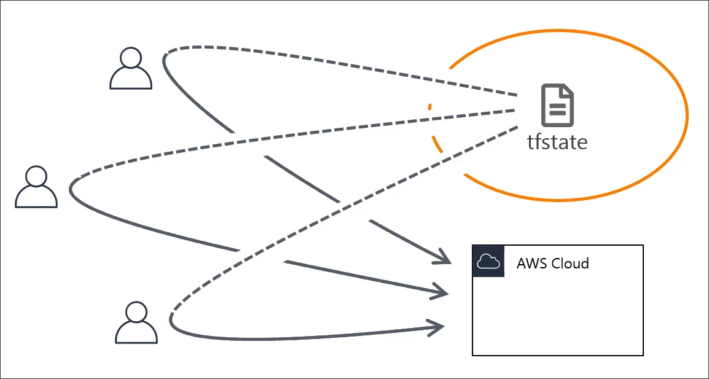
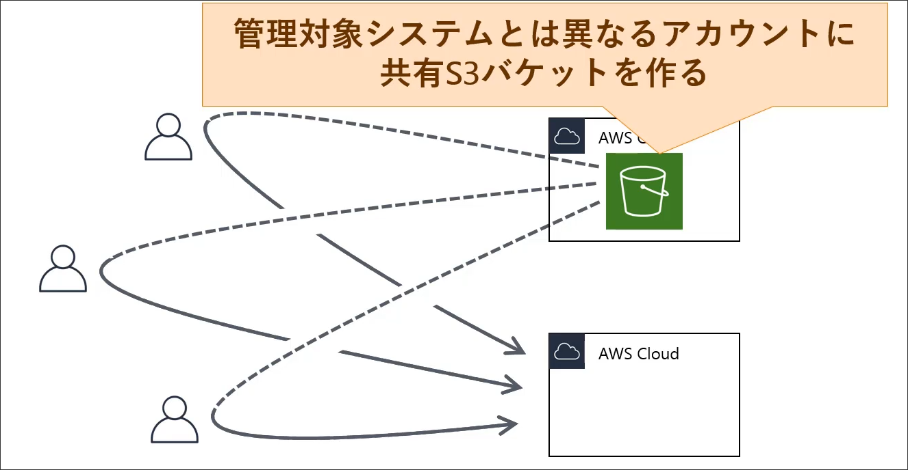
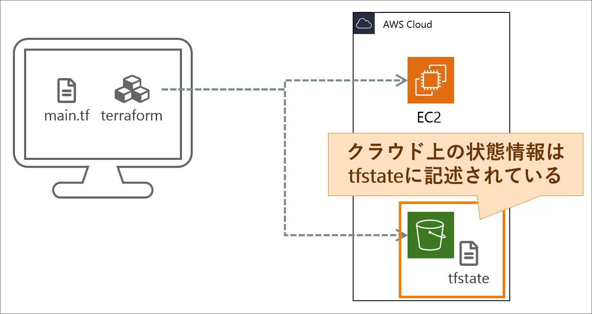
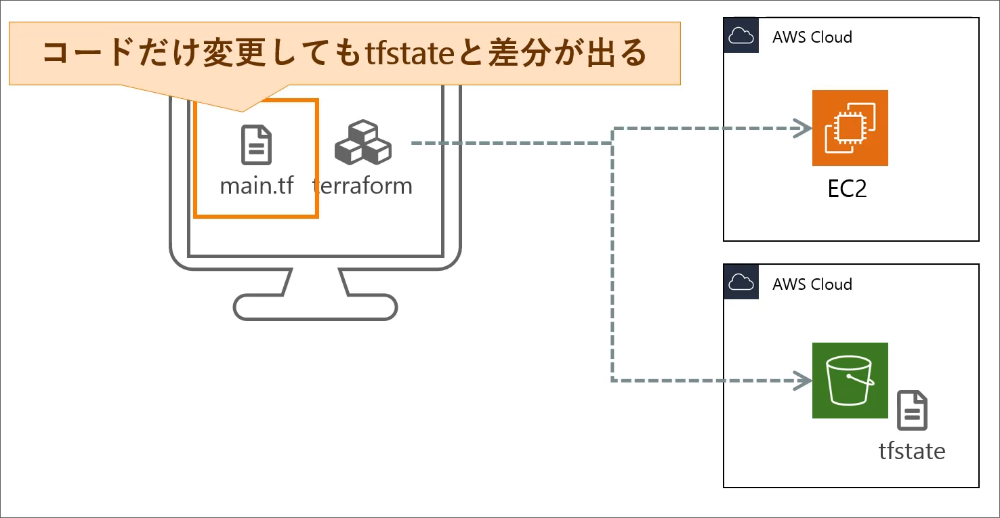
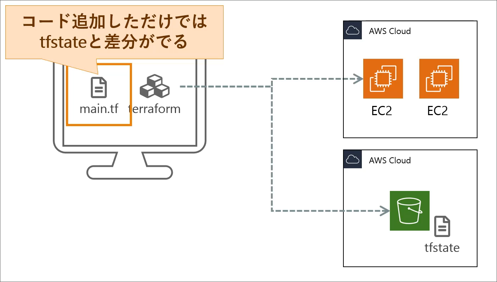
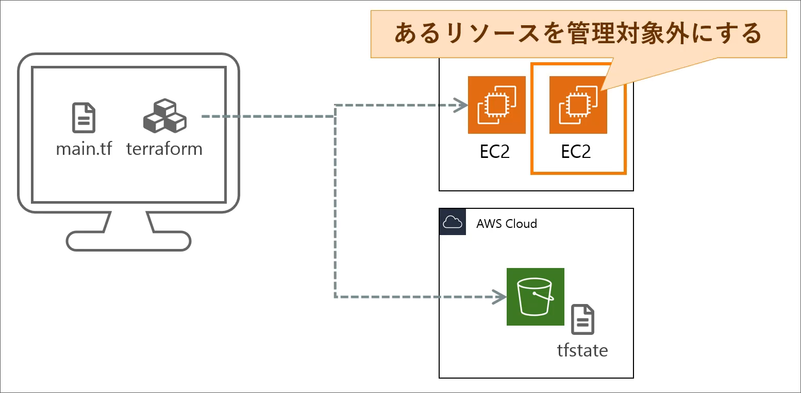
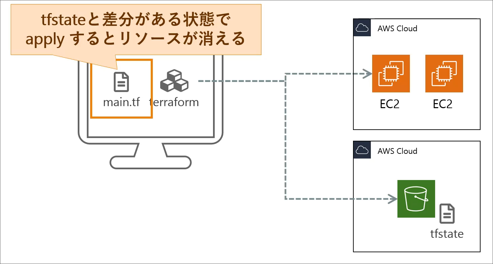
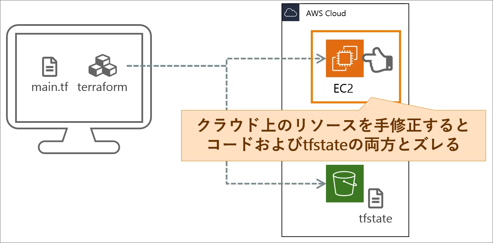

# Introduction
## Contents
## Terraformの管理
複数人でインフラ管理を行う際、複数人で同時に`terraform apply`を実行すると、競合が発生する可能性がある。  


本来であれば、管理対象一つにつき一つの`tfsate`を共有すべきである。

では、どのようにして`tfstate`ファイルを共有すればいいのか。  
AWSを想定した運用では通常、管理対象のシステムとは別のアカウントを作成して、共有S3バッケットに`tfstate`ファイルを保存する。


なお、以降では普段使用しているものと同じアカウントで実行する。

### S3バケットの作成(コンソール)
まず、マネジメントコンソールからS3バケットを作成する。
S3は世界で唯一の名前である必要があることに注意する。
全て設定はデフォルトのままで作成する。
作成が終わり次第、ブロックパブリック・アクセスの設定を全て解除する。
次に、バケットポリシーを編集する。
左上の"ポリシージェネレータ"からポリシーを生成する。

- タイプ: S3バケットポリシー
- Effect: Allow
- Principal: IAMユーザーのARN
- AWS Service: Amazon S3
- Actions: GetObject, PutObject (もしくは全てのアクション)
- Amazon Resource Name (ARN): arn:aws:s3:::バケット名/*

できたjsonをポリシーに貼り付け、保存する。

終わったら、ブロックパブリック・アクセスの設定を全てブロックする。

### tfstateファイルをS3に保存する
以上のような設定を行うためには、`backend`を設定する必要がある。
| 項目 | 型 | 説明 |
| --- | --- | --- |
| `bucket` | block | {bucket: "バケット名", key: "キー", region: "リージョン", profile: "プロフィール"} |

ここで"profile"(プロファイル)は `~/.aws/credentials`に書かれているものを指す。

```hcl
// main.tf
terraform {
  required_providers {
    aws = {
      source  = "hashicorp/aws"
      version = "~> 5.75.0"
    }
  }
  backend "s3" {
    bucket  = "tastylog-tfstate-bucket-xn5"
    key     = "terraform.tfstate"
    region  = "ap-northeast-1"
    profile = "default"
  }
}
```

### terraformで管理しているリソースの一覧を表示する
現在、S3に`tfstate`ファイルが保存されている。

ここで、terraformが管理しているリソースを確認するためには、

```bash
terraform state list [ADDRESS]
```
を実行する。ここで、オプション引数である`ADDRESS`は、絞り込みたいリソースのアドレスを指定する。

```bash
> terraform state list
data.aws_ami.app
data.aws_iam_policy_document.ecs_task_execution_role_policy
data.aws_iam_policy_document.ecs_task_execution_role_trust_policy
data.aws_prefix_list.s3_pl
aws_db_instance.mysql_standalone
aws_db_option_group.mysql_standalone_optiongroup
...
```

### terraformで管理されているリソースの詳細情報の確認
詳細情報もS3の`tfstate`ファイルに保存されている。
この情報を確認するためには、以下のコマンドを実行する。

```bash
terraform state show <ADDRESS>
```

ここでADDRESSは、`terraform state list`で表示された詳細を確認したいリソースのアドレスを指定する。

```bash
> terraform state show aws_instance.app_server
resource "aws_instance" "app_server" {
    ami                                  = "ami-023ff3d4ab11b2525"
    arn                                  = "arn:aws:ec2:ap-northeast-1:186578003896:instance/i-0e89e70045e2da3d2"
    associate_public_ip_address          = true
    availability_zone                    = "ap-northeast-1a"
    cpu_core_count                       = 1
    cpu_threads_per_core                 = 1
    disable_api_stop                     = false
    disable_api_termination              = false
    ...
    ipv6_addresses                       = []
    key_name                             = "web-service-gin-dev-keypair"
    monitoring                           = false
    ...
    placement_partition_number           = 0
    primary_network_interface_id         = "eni-01f3a9dc8bac0fdbe"
    private_dns                          = "ip-10-0-10-104.ap-northeast-1.compute.internal"
    private_ip                           = "10.0.10.104"
    public_dns                           = "ec2-3-112-239-167.ap-northeast-1.compute.amazonaws.com"
    public_ip                            = "3.112.239.167"
    ...
    spot_instance_request_id             = null
    subnet_id                            = "subnet-049ee6519843126c6"
    tags                                 = {
        "Env"     = "dev"
        "Name"    = "web-service-gin-dev-app-ec2"
        "Project" = "web-service-gin"
        "Type"    = "app"
    }
    tags_all                             = {
        "Env"     = "dev"
        ...
        "Type"    = "app"
    }
    tenancy                              = "default"
    user_data_replace_on_change          = false
    vpc_security_group_ids               = [
        "sg-03fa944b3b91c64e2",
        "sg-0556715ed32f0135c",
    ]

    capacity_reservation_specification {
        capacity_reservation_preference = "open"
    }

    cpu_options {
        amd_sev_snp      = null
        ...
        threads_per_core = 1
    }

    credit_specification {
        cpu_credits = "standard"
    }

    enclave_options {
        enabled = false
    }

    maintenance_options {
        auto_recovery = "default"
    }

    metadata_options {
        http_endpoint               = "enabled"
        ...
        instance_metadata_tags      = "disabled"
    }

    private_dns_name_options {
        enable_resource_name_dns_a_record    = false
        enable_resource_name_dns_aaaa_record = false
        hostname_type                        = "ip-name"
    }

    root_block_device {
        delete_on_termination = true
        ...
        volume_id             = "vol-08b5b330ecd751eaa"
        volume_type           = "gp3"
    }
}
```
このように、terraformで実際に記述するような情報が表示される。

### terraformで管理されているリソース名の変更
terraformで管理するリソースには名前を付けていっていた。
これらの名前を変更したい場合は単純に`.tf`ファイルのリソース名を変更すればいいのだろうか。

実際に名前を変更して`terraforma apply`をしてみる。すると、terraformからは`terraform.tfstate`と差分が生じているため、新しいリソースが追加され、古いリソースが無くなったとみなされ、新しいリソースが追加され、古いリソースが削除される。(名前だけ変更しただけなのに)



このため、コードの変更だけでなく、`terraform.tfstate`も変更する必要がある。

```bash
terraform state mv <ADDRESS> <NEW_ADDRESS>
```
紛らわしいのが、localで実行しているのにも関わらず、実際に操作対象となっているのがリモートのS3の`tfstate`ファイルであるということである。

```bash
> terraform state mv aws_instance.app_server aws_instance.app_server2
```
この状態で`terraform plan`を実行すると、`app_server2`がソースコードに存在しないので、削除するという結果が表示される。  
この状態で`appserver.tf`の`resource`を`app_server2`に変更する。
そして、`terraform apply`を実行すると、`app_server`が削除され、`app_server2`が追加される。

### terraformで管理していなかったリソースを管理対象にする
マネージメントコンソールでリソースを作成し、それをterraformで管理したい場合、`terraform import`を使う。

単純にマネージメントコンソールで作成したリソースをlocalにある`.tf`ファイルに書き込んで、`terraform apply`を実行しても、S3にある`tfstate`ファイルとの整合性が取れない。


そのため、localの`.tf`ファイルに書き込むことに加えて、
S3の`tfstate`にもリソースを取り込む必要がある。

S3の`tfstate`にリソースを取り込むためには、以下のコマンドを実行する。

```bash
terraform import <ADDRESS> <ID>
```
ここで、`ADDRESS`は取り込み先のアドレス(terraformのソースコード上のアドレス)、`ID`は取り込みたい(稼働中の)リソースのID(ec2であればi-0213...)を指定する。

まず、(外部からアクセス可能な)適当なEC2インスタンスを作成し、そのID(たとえば、`i-0217bdf103bf419b3`)を取得する。

まず、localの`.tf`ファイルにリソースを追加する。
```hcl
resource "aws_instance" "test" {
}
```
次に、以下のコマンドを実行する。
```bash
terraform import aws_instance.test i-0217bdf103bf419b3
```
これで、S3の`tfstate`にリソースが取り込まれる。
実際、
```bash
terraform state list | grep test
terraform state show aws_instance.test
```
などで確認することができる。
特に`terraform state show` で確認した`ami`と`instance_type`などの情報を`.tf`ファイルに追記することで、terraformで管理することができる。

```hcl
resource "aws_instance" "test" {
  ami = "ami-023ff3d4ab11b2525"
  instance_type = "t2.micro"
}
```
ここで, `terraform plan`を実行すると"No changes."と表示される。

### terraformで管理しているリソースを管理対象から外す

terraformで管理していたリソースを管理対象から外すにはどうしたらいいだろうか。
単純に考えて、localにある`.tf`ファイルからリソースを削除し、`terraform apply`を実行するとする。この方法では、S3にあるtfstateファイル`terraform plan`で作成された状態に差分があるため、リソースごと削除してしまう(本来は管理対象から外したいだけ)。


そこで、S3のtfstateファイルにあるリソースを管理対象から外す必要がる。

以下のコマンドでリソースを管理対象から外すことができる。
```bash
terraform state rm <ADDRESS>
```
ここで、`ADDRESS`は管理対象から外したいリソースのアドレス(aws_instance.test)を指定する。

まず、localにある`.tf`ファイルからリソースを削除(もしくはコメントアウト)する。
(この状態では`terraform state list | grep test`を実行してもリソースが表示される。)

次に、以下のコマンドを実行する。
```bash
terraform state rm aws_instance.test
```
これで、S3のtfstateファイルからリソースが削除される。

### terraformで管理しているリソースをコンソールで修正した場合の補正
AWSコンソール上でリソースを修正した場合、localの`.tf`ファイルにも、S3上の`tfstate`ファイルにも実際のAWSリソースとのズレが生じる。



まずは、実際のAWSリソースとS3にある`tfstate`ファイルのズレを修正する。
以下のコマンドでそれを実行する。

```bash
terraform refresh
```

まず、適当にEC2インスタンスを変更する。(適当なタグを付けたり)
次に、`terraform refresh`を実行する。
すると、S3の`tfstate`ファイルが更新される。
ここで、`terraform plan`を実行すると、適当なタグが付いているので削除する旨について表示される。
`terraform apply`を実行すると、EC2インスタンスに適当に付けたタグが削除される。


ここでは、localの`.tf`ファイルを基準として、AWSリソースとのズレを修正することができた。
