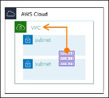
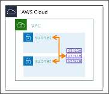
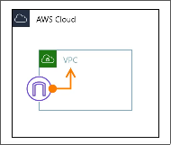
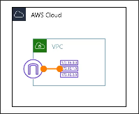
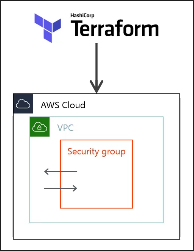

# Introduction
## Contents
## VPCの作成
[公式はここ](https://registry.terraform.io/providers/hashicorp/aws/latest/docs/resources/vpc)
`aws_vpc`はVPCリソースを作成する。

| 項目 | 型 | 説明 |
| --- | --- | --- |
| `cidr_block` | string | IPv4 CIDRブロック |
| `assign_generated_ipv6_cidr_block` | string | IPv6 CIDRブロック |
| `instance_tenancy` | string | テナンシー("default"or "dedicated") |
| `enable_dns_support` | bool | DNS解決の有効化 |
| `enable_dns_hostnames` | bool | DNSホスト名の有効化 |
| `tags` | object | タグ |

### Example
以下は公式ドキュメントに載っている例より項目が多いが, コンソールで作成する場合にはこれらの項目が設定される。
```hcl
resource "aws_vpc" "vpc" {
  cidr_block       = "10.0.0.0/16"
  instance_tenancy = "default"
  enable_dns_support = true
  enable_dns_hostnames = true
  assign_generated_ipv6_cidr_block = false

  tags = {
    Name = "${var.project}-${var.environment}-vpc"
    Project = var.project
    Env = var.environment
  }
}
```

## Subnet
```d2
VPC <- subnet
```

VPCとSubnetは依存関係がある。
今回もVPCと同じようにresourceブロックを使う。
`aws_subnet`はサブネットリソースを作成する。

| 項目 | 型 | 説明 |
| --- | --- | --- |
| `vpc_id` | string | VPCのID |
| `availability_zone` | string | サブネットのアベイラビリティゾーン |
| `cidr_block` | string | IPv4 CIDRブロック |
| `map_public_ip_on_launch` | bool | このサブネットの中でインスタンス起動時にパブリックIPをマッピングするかどうか |
| `tags` | object | タグ |

### Example
public subnet
```hcl
resource "aws_subnet" "public_subnet_1a" {
  vpc_id = aws_vpc.vpc.id
  availability_zone = "ap-northeast-1a"
  cidr_block = "10.0.0.0/20"
  map_public_ip_on_launch = true
  tags = {
    Name = "${var.project}-${var.environment}-public-subnet-1a"
    Project = var.project
    Env = var.environment
    Type = "public"
  }
}
```

private subnet
```hcl
resource "aws_subnet" "private_subnet_1a" {
  vpc_id = aws_vpc.vpc.id
  availability_zone = "ap-northeast-1a"
  cidr_block = "10.0.16.0/20"
  map_public_ip_on_launch = false

  tags = {
    Name = "${var.project}-${var.environment}-public-subnet-1a"
    Project = var.project
    Env = var.environment
    Type = "private"
  }
}
```
ここでは, パブリックサブネットには`map_public_ip_on_launch = true`を設定している。

## ルートテーブルの作成
```d2
VPC <- route table <- route table association -> subnet
```
AWS providerを用いたterraformにおけるルートテーブルの仕組みは少し面倒で、以上のような関係がある。
つまり、単純にルートテーブルを作成するだけでは終わりというわけではなく、ふたつのリソース（route tableとroute table association）を作ってはじめてルートテーブルが有効になる。
どちらもリソースであるため、resourceブロックを使って作成する。

route tableはルートテーブルリソースを提供し、
route table associationはルートテーブルとサブネットの関連付けを提供する。
つまり、route tableという"点"とその点をサブネットという点につなぐ線がroute table associationである。

### route table
| 項目 | 型 | 説明 |
| --- | --- | --- |
| `vpc_id` | string | VPCのID |
| `tags` | object | タグ |



### route table association
| 項目 | 型 | 説明 |
| --- | --- | --- |
| `route_table_id` | string | ルートテーブルID |
| `subnet_id` | string | サブネットID |



### Example
```hcl
resource "aws_route_table" "public_rt" {
  vpc_id = aws_vpc.vpc.id
  tags = {
    Name = "${var.project}-${var.environment}-public-rt"
    Project = var.project
    Env = var.environment
    Type = "public"
    }
}

resource "aws_route_table_association" "public_rt_1a" {
  route_table_id = aws_route_table.public_rt.id
  subnet_id = aws_subnet.public_subnet_1a.id
  }
```

果たしてルーティングの設定ってこれで合ってたっけ？という疑問がある。

なお、ここでは`aws_route`は使用していないことに注意。
`aws_route`はルートテーブルとインターネットゲートウェイの関連付けに使用される。

## インターネットゲートウェイの作成
インターネットゲートウェイに必要な項目・リソースは
`aws_internet_gateway`と`aws_route`である。
```d2
VPC <- internet gateway <- route <- route table
```
| 項目 | 型 | 説明 |
| --- | --- | --- |
| `vpc_id` | string | VPCのID |
| `tags` | object | タグ |



### aws_route
| 項目 | 型 | 説明 |
| --- | --- | --- |
| `route_table_id` | string | ルートテーブルID |
| `destination_cidr_block` | string | ルートの宛先 |
| `gateway_id` | string | インターネットゲートウェイID |

外向き（どこにいくか）にすべての通信を許可したい場合は`destination_cidr_block = 0.0.0.0/0`とする。


#### Example
まずは、インターネットゲートウェイを作成する。
```hcl
resource "aws_internet_gateway" "igw" {
  vpc_id = aws_vpc.vpc.id
  tags = {
    Name = "${var.project}-${var.environment}-igw"
    Project = var.project
    Env = var.environment
  }
}
```
次に、ルートテーブルにルートを追加する。
```hcl
resource "aws_route" "public_rt_igw_r" {
    route_table_id = aws_route_table.public_rt.id
    gateway_id = aws_internet_gateway.igw.id
    destination_cidr_block = "0.0.0.0/0"
}
```

## セキュリティグループの作成

セキュリティグループはインスタンスやリソースに対するアクセス制御を行う。
セキュリティグループは２つのリソースで構成される。
- `aws_security_group` : セキュリティグループリソースを提供
- `aws_security_group_rule`: セキュリティグループのルールを提供
である。

```d2
VPC <- security group <- security group rule
```

### aws_security_group
| 項目 | 型 | 説明 |
| --- | --- | --- |
| `name` | string | セキュリティグループ名 |
| `description` | string | 説明 |
| `vpc_id` | string | VPCのID |
| `tags` | object | タグ |

### aws_security_group_rule
| 項目 | 型 | 説明 |
| --- | --- | --- |
| `security_group_id` | string | セキュリティグループID |
| `type` | enum | ルールのタイプ、`ingress`, `egress` |
| `protocol` | enum | `tcp`, `udp`, `icmp`, etc... |
| `from_port` | number | 開始ポート or 開始ICMPタイプ番号 |
| `to_port` | number | 終了ポート or 終了ICMPタイプ番号 |
| `cidr_blocks` | string[] | CIDRブロック |
| `source_security_group_id` | string | アクセス許可したいセキュリティグループID |

### aws_prefix_list
複数のCIDRブロックをまとめて管理するためのリソースをprefix listという。  
S3などのAWSリソースはDNS名で指定されるが、その裏では複数のIPアドレスが割り当てられている。AWSのマネージドprefix listはAWSリソースのIPアドレス群に名前をつけて管理することができる。

なぜprefix listのような機能が必要なのかというと, DNS名はセキュリティグループのルールやネットワークACLのルールに指定できないためである。
たとえばS3はVPCの外にあるサービスなのでHTTPやHTTPSでアクセスする必要がある。しかし、相手のDNS名をセキュリティグループの宛先に設定できないため、S3へのアクセスを許可するルールは"任意のIPアドレス・80ポートにアクセス"となってしまう。しかし、これはセキュアではない。

また、VPCエンドポイントやVPN接続などのリソースに対してもprefix listを使うことができる。

| 項目 | 型 | 説明 |
| --- | --- | --- |
| `prefix_list_id` | string | プレフィックスリストIDで検索 |
| `name` | string | プレフィックスリスト名で検索 |

