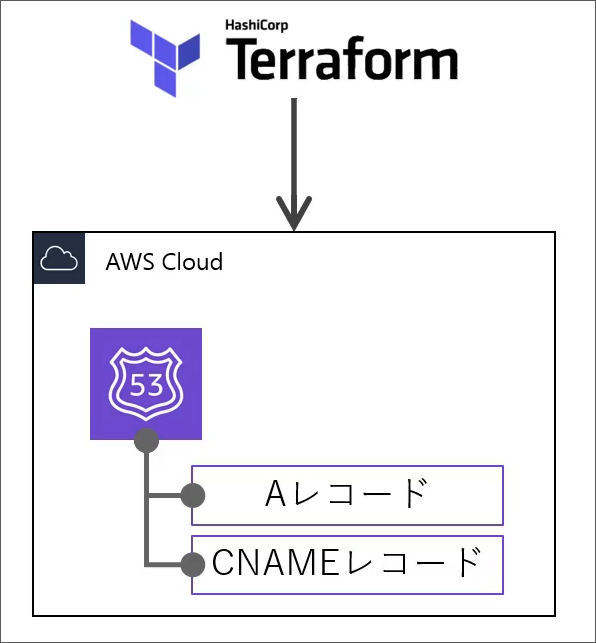

# Introduction
## Contents
## Route53
ELBのデータ構造は次のようになっている。
```d2
Route53 Zone <- Route53 Record
```
### aws_route53_zone
| 項目 | 型 | 説明 |
| --- | --- | --- |
| name | string | Route53 Zone名 |
| force_destroy | bool | terraform以外で管理しているレコードが存在する場合、削除するかどうか |

作成の流れとしては、
- ホストゾーンの作成
- Aレコードの作成
- ドメイン取得元に対する設定

となる。

```hcl
resource "aws_route53_zone" "route53_zone" {
  name          = var.domain
  force_destroy = false
  tags = {
    Name    = "${var.project}-${var.environment}-domain"
    Project = var.project
    Env     = var.environment
  }
}
```



### aws_route53_record

パターンには
- Aレコード(IPアドレス指定)
- Aレコード(AWSリソース指定)
- CNAMEレコード(ドメイン名指定)

| 項目 | 型 | IP指定 | リソース指定 | ドメイン指定 | 説明 |
| --- | --- | --- | --- | --- | --- |
| zone_id | string | o | o | o | ホストゾーンID |
| name | string | o | o | o | レコード名 |
| type | enum | o | o | o | レコードタイプ("A", "CNAME"など) |
| ttl | number | o | x | o | TTL (キャッシュ有効期間) |
| records | string[] | o(EIP) | x | o | トラフィックルーティング先 |
| allow_overwrite | bool | o | o | o |  既に存在する場合、上書きしてよいか |
| alias | block | x | o | x | トラフィックルーティング先(AWSリソース) |

aliasは以下の通り、
| 項目 | 型 | 説明 |
| --- | --- | --- |
| name | string | DNSドメイン名 |
| zone_id | string | ホストゾーンID |
| evaluate_target_health | bool | ヘルス評価するか |

aliasはリソース指定の場合、
ALBの場合
```hcl
name = <ADDRESS>.dns_name
zone_id = <ADDRESS>.zone_id
```

CloudFrontの場合
```hcl
name = <ADDRESS>.domain_name
zone_id = <ADDRESS>.hosted_zone_id
```

AWSリソースを指定する場合、以下のようになる。
```hcl
resource "aws_route53_record" "route53_record" {
  zone_id = aws_route53_zone.route53_zone.zone_id
  name    = var.domain
  type    = "A"
  alias {
    name                   = aws_lb.alb.dns_name
    zone_id                = aws_lb.alb.zone_id
    evaluate_target_health = true
  }
}
```

ドメインサービスに対する(NSレコードの)設定は省略する。

