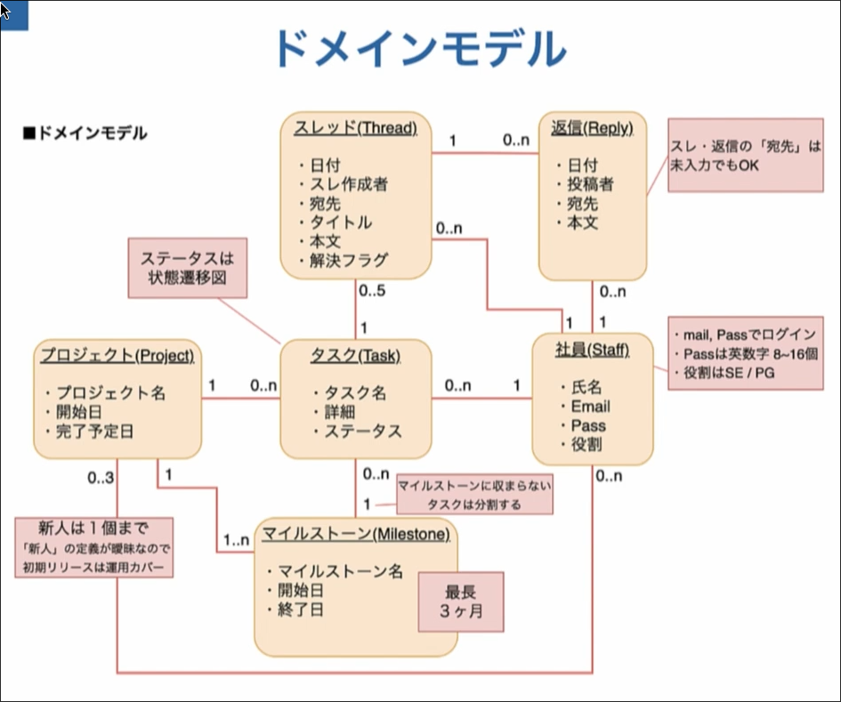

# Introduction
## Contents
## ドメインモデル図

ドメインモデル図はシステムに登場する概念を体系的に整理して、どのようなデータ構造が必要か？システム内部のデータ構造はどうあるべきか？を分析し、明らかにする。

登場する概念の関係性、つまり、人やモノやルールがどのようなデータ構造で表現されて、どのように関わり合っているのかを明らかにすることが目的となる。

ER図やクラス図と言った後工程の設計につながる重要な工程である。

システムに登場する概念を体系的に整理して、**データ構造はどうあるべきか？**について分析し、明らかにする。

### 作り方
作り方は簡単。

1. 前工程で作成したコンテキスト図・ユースケース図を参考にして、システムに登場する概念を洗い出す。 (例: プロジェクト、タスク、ユーザーなど)
  - ここで、プロジェクト名・開始日などのデータの属性を入れておくと後で楽。
  - 概念を洗い出していく工程で、新しいデータ構造を導入することもある。例えば、プログラマー・デザイナー...などを個々に管理する必要がる場合、"社員"といったデータ構造を導入し、役割という属性を与えたり。(なお、ここで役割がプログラマー・デザイナーの２つを入れるとしたら、その旨もコメントしておくと良い。)
2. 概念の関係性を線で結び、n:mのような多重度を明示する。
  - 0..nか1..nかについてユースケース図に立ち戻ってシステムがユーザーにどのように使われるかを想像すると良い。
3. システムが実際にどのように使われるかを想像し、明確でない部分はヒアリングを通じて補完し、後工程のため(システム内部での制御で使うため)にとにかくコメントとして情報を残す。
  - データの属性について詳しく考える。例えば、"パスワードは英数字8文字にする"などもコメントに書いておくと良い。
  - 個々のデータ構造とその多重度の関係によっては、暗黙のルール(例: マイルストーンに紐付いていないタスクは作業中にできない)が見つかることもある。こういうのもコメントに書いておくと良い。
