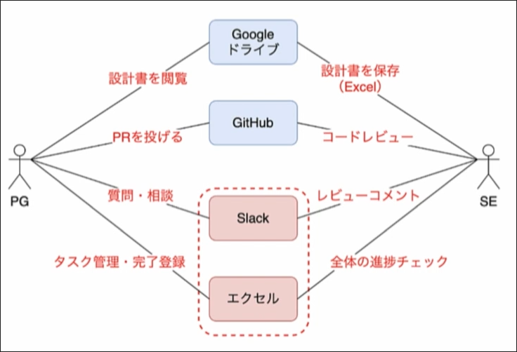

# Introduction
## Contents
## 要件定義
以下では
- 誰が?:
  - システムエンジニアが
  - プログラマーが
- 何をしたい?
  - タスク・ステータス・進捗を管理したい。
  - タスクに紐づくスレッド内で質問・コメントで会話したい。
- 背景となる課題:
  - エクセルでのタスク管理が煩雑になりすぎて管理の限界が見えてきた。
  - Slackで会話すると、質問・レビューが散らばってしまい、レビューとタスクが紐付かない。

といった要件定義があるとする。

### ユースケース分析
ユースケース分析:
ユースケース分析は次の工程で構成される。
- [コンテキスト分析](../context-diagram)
- [ユースケース分析](../usecase-diagram)

の２つだ。

コンテキスト図もユースケース図も、Userとシステムの関係性を表している。  
システムがどのような(外部との)コンテキストで動作するのかを明らかにすることが目的となるのだ。

そして、その分析はイコール図の作成になる。

### コンテキスト図

この図では赤い点線で囲まれた部分がシステム化対象を表す。Userがどんな文脈で(どんなUserがどんな目的で)そのシステムを利用するのか、外部の環境も含めて考察・図示している。

コンテキスト分析では、これから作成しようとしているシステムのみに注目するのでは無く、そのシステムがどのように外部と関わり合っているのかを明らかにする。

### ユースケース図

ここでも赤線で囲まれた部分が作成する予定のシステムとなる。

コンテキストに関する情報をさらに詳細に分析したものが、ユースケース図となる。

### ドメインモデル図

ドメインモデル図はシステムに登場する概念を体系的に整理して、どのようなデータ構造が必要か？システム内部のデータ構造はどうあるべきか？を分析し、明らかにする。
