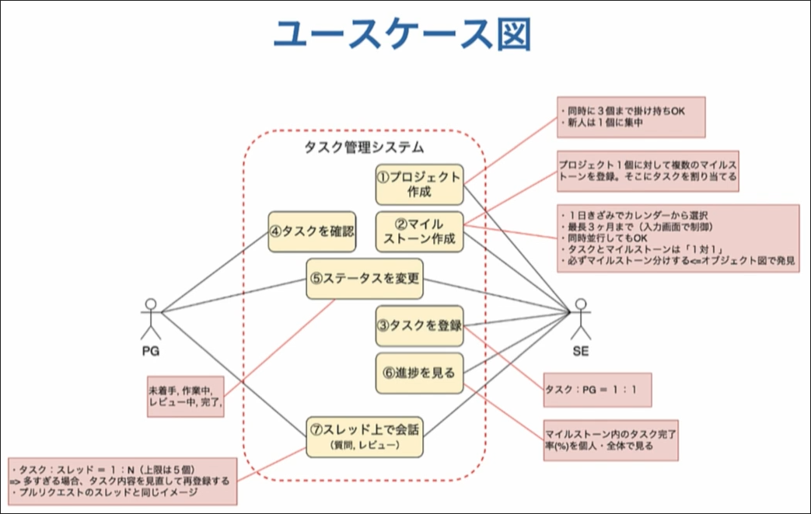

# Introduction
## Contents
## ユースケース図

ここでも赤線で囲まれた部分が作成する予定のシステムとなる。

コンテキストに関する情報をさらに詳細に分析したものが、ユースケース図となる。

要件定義に記載されている"何をしたい？"を、図として落とし込んでいく。

### 作り方
作り方は簡単。

この段階で、隠れた要求を見つけることが重要。

1. システムを利用する人（User）を書く。
2. どんなSystemを作成するのかを赤枠の上にタイトルとして書く。
3. "何をしたい？"を参考に、どのUserがどの要求を行うのかをUserの近くの赤枠内に書く。
  - "タスクに紐づくスレッド上で会話"など、要求するUserが複数人の場合は、双方に近い位置に要求を書く。
  - "タスクを管理する"としか要件に書かれていなかったとしても、前提となる"タスクを登録する"などの暗黙の要求が存在することが多い。そのような要求も含めて書くことがポイント。
  - "プロジェクトを作成する"・"マイルストーンを作成する"などのように、ここで新しい要求が見つかることもある。
4. Userと要求の関係を矢印で結ぶ。
5. 後でドメインモデルを作成することを念頭に、ヒアリングを通じて、要求の詳細を深堀して、コメントとして記載する。
  - "ステータスを変更する"のステータスにはどんな種類(未着手・作業中など)があるのか？
  - "1つのタスク"につき複数のプログラマーが割り当てられるか？
  - "マイルストーン"は一日単位で設定するのか？週単位で設定するのか？
  - ただし、先の工程に進んでから後戻りすることも多々ある。
