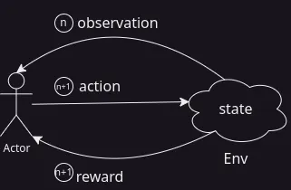

## はじめに
機械学習には
- 教師あり学習
- 教師なし学習
- 強化学習
のように分類される。
このなかでも強化学習はalpha-goや自動運転、chatgptなどのある種エポックメイキングな成果を出している。
にもかかわらず、この技術を研究している上の２つに比べて、一般的ではないようにかんじる。

私は強化学習を前職で使用していたこともあり、少し詳しい。

なぜ、強化学習が一般的ではないのか？その理由は主に２つ考えられる。
1. 成果が出るかわからないにもかかわらず、高度な知識を必要とし、リスクが高い。
1. 操作対象となる環境をシミュレーションする必要があるが、その再現が難しい。

第一に、強化学習は教師あり学習や教師なし学習とはことなり、制御工学にそのルーツを持つ。
強化学習という分野はいわゆるニューラルネットワーク(NN)の登場以前から存在しており、
NNの登場により、脚光をあびるようになった。
そのため、もともと制御工学の数学色の濃い理論にいかにNNを組み込むかが課題となっており、
教師あり学習や教師なし学習に比べて、高度な知識が必要となる。

第二に、強化学習は制御対象に該当する"環境"をシミュレーションする必要がある。
この環境のシミュレーションが非常に難しいのだ。
というのもalpha-goなどのように囲碁や将棋などのボードゲームであればシミュレーションは容易だが、
実際の環境、例えば、自動運転車やロボットの制御など、物理シミュレーションを行う必要があり、また、それでも不十分である場合があるので、
現実でトレーニングする必要がある。これが非常に高くつく。

そのため、近年ではすでに溜まっているデータを使って、強化学習を行う手法、所謂オフライン強化学習などが研究されている。

### 強化学習
強化学習は制御工学の一分野であり、問題設定としては制御主体となるエージェント(Agent)と被制御対象となる環境(Env)の間の相互作用を考える。
Agentは環境にたいして行動(action)をとり、Envはその行動に応じて内部の状態(state)を変化させ、観測値(observation)を返し、報酬(reward)を返す。
なお、状態と観測値は一致する場合がある。

最も単純な例として、Agentが複数のスロット台を操作し、最大の報酬を得るという問題を考える。
これは多腕バンディット問題と呼ばれる。

ここで、複数のスロット台が環境となる。
ただ、この環境はstateがステップ毎に変化せず、報酬のみが返される。
このような環境を非定常環境と呼ぶ。
また、Envのstateはactionにより変化しない。

さて、Agentは最大の報酬を得たいとしよう。
この場合、スロット$e = \set{e_0, e_1, \ldots, e_{N-1}}$に対して、
行動$a = \set{a_0, a_1, \ldots, a_{N-1}}$をとる。
なお、$a_i$は$e_i$を選択し、プレイするということを意味する。
また、確率$\pi(A(\omega) = a_i) = \pi(A = a_i) = 1$で行動$a_i$をとるとする。
この場合、状態や観測値は変化せず、報酬$r$を得ることができる。

この場合、行動$a_i$を行った場合のAgentが得る報酬の期待値$R$は
$$
q(a_i) = \mathbb{E}[R|A=a_i] = \frac{1}{n}\sum_{j=0}^{n-1} r_j
$$
となる。

$q(A)$を行動価値関数と呼ぶ。
とはいっても行動価値関数はただの平均なのでその更新式は以下のようになる。
実際の行動価値関数を$q(A)=Q_n$とする。
$$
\begin{aligned}
Q_{n} &= \frac{1}{n}((n-1)Q_{n-1} + r_{n-1}) \\
&= \frac{n - 1}{n}Q_{n-1} + \frac{1}{n}r_{n-1} \\
&= (1 - \frac{1}{n})Q_{n-1} + \frac{1}{n}r_{n-1} \\
&= Q_{n-1} - \frac{1}{n}Q_{n-1} + \frac{1}{n}r_{n-1} \\
&= Q_{n-1} + \frac{1}{n}(r_{n-1} - Q_{n-1}) \\
\end{aligned}
$$
特に、
$$
Q_n \leftarrow \frac{1}{n}(r_{n-1} - Q_{n-1})
$$

さて、どのスロットを選べば最大の報酬を得られるだろうか？
そう、単純に最大の行動価値関数を持つスロットを選べば良い。
$$
a^* = \argmax_{a_i} q(a_i)
$$
ここで、最大の行動価値関数を持つ行動を$a^* $のようにして表す。
しかし、最初の段階ではどのスロットが最大の行動価値関数を持つかわからない。
そこで、確率$\epsilon$でランダムにスロットを選び、それ以外の場合は最大の行動価値関数を持つスロットを選ぶという方法をとる。
この手法を$\epsilon$-greedyと呼ぶ。

さて、以上で多腕バンディット問題の解法を説明したが、これを入口として未知な環境に対する強化学習には主に２つの手法がある。
- 価値ベースの手法
- 方策ベースの手法

多腕バンディット問題は価値ベースの手法である。
価値ベースの手法は上で説明したようにだいたいが最大の行動価値関数を計算し、行動価値関数を最大にする行動を選択するという流れである。
次にもう一方の方策ベースの手法について説明しよう。
バンディット問題では行動$a_i$が確率$\pi(A=a_i)=1$で選択されるとした。
より一般には観測値$o$が観測された条件のもとで行動$a$を選択する確率$\pi(A=a|O=o)$を方策と呼ぶ。
上の例では方策はどの$a$に対しても確率が$1$であったが、
方策はAgentがどのように行動するかを表す確率分布であるため、Agentの行動を決定するためには方策を決定する必要がある。
そして、この方策を勾配法により最適化することが方策ベースの手法である。

方策が何かしらの変数$\pi(a|o; \bm{\theta})$で表されるとしよう。
この$\bm{\theta}$は例えば、$\pi$を正規分とした場合の平均$\mu$や分散$\sigma$などを表現するパラメータである。
方策パラメータとも呼ばれる。
(確率分布の全体の集合における局所座標を表すとも考えられる)
実用上、これらのパラメータはNNで表されることが多い。
つまり、$\mu(o; \bm{\theta})$や$\sigma(o; \bm{\theta})$は
$$
\mu(\cdot; \bm{\theta}) : \mathcal{O} \to \mathbb{R}^m
$$
を再現するNNとなる。
<!-- (これは確率密度関数における局所座標$\bm{\theta}$上の関数である。) -->
<!-- ともかく、この確率分布を最適化するために方策勾配法を用いる。 -->
<!-- 報酬の最大値は -->
<!-- $$ -->
<!-- J_{\bm{\theta}) = \mathbb{E}[R|\bm{\theta}] -->
<!-- $$ -->
さて、次回からはより精密に価値ベースの手法や方策ベースの手法について説明していく。

#### コラム: 確率変数について
確率や確率変数は中学・高校の数学で習うが、そこでは確率というものを直感的に理解することが目的であり、厳密な定義はされない。
そのため、次の言葉は少々混乱をきたすかもしれない。

"確率変数は変数ではなく関数である。"

> *def*:  
> 可測空間$(S, \mathcal{F})$と可測空間$(E, \mathcal{G})$に対して  
> 写像$f: S \rightarrow E$が
> 任意の$B \in \mathcal{G}$に対して$f^{-1}(B) \in \mathcal{F}$を充たすとき、
> 写像$f$は可測関数であるという。

そして確率空間$(\Omega, \mathcal{F}, P)$における(主に$\mathbb{R}$への)写像を確率変数とよぶ。
$$
X: \Omega \rightarrow \mathbb{R}
$$

なぜ、こんな回りくどい定義をするのかというと、論理体系の柔軟性を上げるためである。
たとえば、サイコロを振って出た目が$3$以下である確率を考える。
この場合、サイコロを振ってどのような目がでるかについての標本空間を$\Omega={1, 2, 3, 4, 5, 6}$とする。
また、考える事象が$3$以下であるならば$\set{\omega; \omega \le 3}$となるだろう。
だが、これでは考える事象によって、標本空間が考える問題毎に様々であり、一般的な議論ができない。
そこで、その表現の多様さを写像$X$によって隠すことで、一般的な議論ができるようになる。

そして、考えている事象が$\sigma$加法族に属するために、確率変数は可測関数でなければならない。

<!-- https://q.uiver.app/#q=WzAsNCxbMiwxLCJcXG1hdGhiYntSfSJdLFswLDEsIlxcbWF0aGNhbHtGfSJdLFswLDAsIlxcT21lZ2EiXSxbMiwwLCJcXG1hdGhiYntSfV5tIl0sWzEsMCwiUCIsMl0sWzIsMywiWCJdLFszLDEsIlheey0xfSIsMV1d -->
<iframe class="quiver-embed" src="https://q.uiver.app/#q=WzAsNCxbMiwxLCJcXG1hdGhiYntSfSJdLFswLDEsIlxcbWF0aGNhbHtGfSJdLFswLDAsIlxcT21lZ2EiXSxbMiwwLCJcXG1hdGhiYntSfV5tIl0sWzEsMCwiUCIsMl0sWzIsMywiWCJdLFszLDEsIlheey0xfSIsMV1d&embed" width="432" height="304" style="border-radius: 8px; border: none;"></iframe>

つまり、
$$
P(X \le 3) = P(\set{\omega; X(\omega) \le 3})
$$
という意味なのである。
