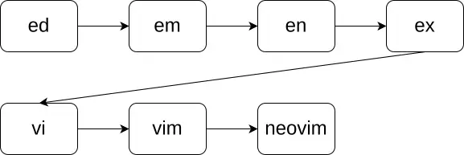
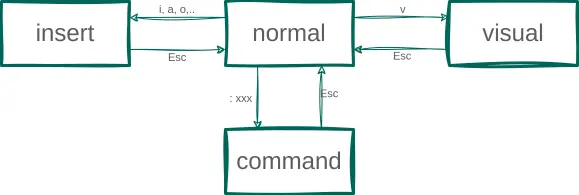
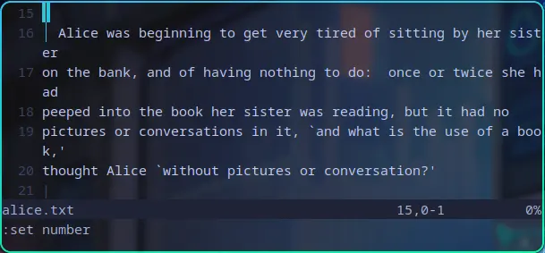
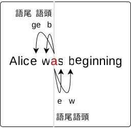

## Contents
## vimの家系図
> はじめに神はターミナルを創造された。  
> 神は"edあれ"と言われた。するとedがあった。

そこにはまだCRT端末、つまり画面が無かった。  
ロール紙にソースコードが印字され、テレタイプ端末(ターミナル)で編集する時代だ。  
ターミナルの入力は中央メインフレームに送られ、その結果がターミナルに表示される。  
そんな、時代に生まれたのがedだった。

edとは現在でも残るエディタの祖先である。

edは一行しか編集できない所謂ラインエディタで、現代の視点から見ると使い勝手はあまりよくない。  
edは進化し、em, en, exとなった。  
この時代には画面をもつ端末が登場しそれに伴い、exはスクリーンエディタとして進化していた。

このexで画面を編集する際に":visual"というコマンドを使う。  
もしくは":vi"というコマンドを使う。  
こうしてviは生まれた。  

vimはviの拡張であり、vi improvedの略である。  
vimとviの機能の差は":h vi-differences"で確認できる。
近年ではvimがviよりも使われることが多い。  
また、vimのさらなる派生系としてneovimなどが使われている。

## モード
vimには4つのモードがある。

- ノーマルモード
- インサートモード
- ビジュアルモード
- コマンドラインモード

である。  
基本的にどのモードでもESCを押すことでノーマルモードに戻ることができる。  
困ったらESCを押そう。  
また、ESCの代わりにCtrl+[でもノーマルモードに戻ることができる。  
個人的にはESCよりもCtrl+[の方が押しやすいのでこちらを使用している。

## ノーマルモード
言葉通り、ノーマルモードとはvimの通常のモードであると同時に、"いつでも動き出せる"という意味を持つ。  
ノーマルモードはvimの基本であるが、ノーマルモードを極めることはvimを極めることに等しい。

少し考えてほしい。プログラムや文章を書く時、エディタを使用していなければそのプログラムや文章について考えていない、などということがあるだろうか。知的作業の多くは実際に手を動かし、書くことよりもコピー＆ペーストや削除や移動、自分が書いた成果物を眺めている時間が長い。  
ノーマルモードはそういった作業を効率化する。  

以下ではノーマルモードの基本的な要素

- motion
- 削除・コピー・ペースト
- 繰り返し

について説明する。
これら3つを押さえることで、vimを使いこなしていると言っても過言ではない。

### motion
ノーマルモードではmotion(カーソル移動)を最もよく使う。
vimのmotionは有名で、'hjkl'でカーソルを移動する。
| command | description             |
| :---:   | :----                   |
| h       | ←に1文字                |
| j       | ↓に1文字                |
| k       | ↑に1文字                |
| l       | →に1文字                |
| 0       | 行の先頭(Oではなくゼロ) |
| ^       | (空白を除く)行の先頭    |
| $       | 行の末尾                |

これはすばらしい。ホームポジションから手を動かすこと無くカーソルを移動できる。  
だがしかし、このmotionに頼るべきではない。
2回以上同じキーを押すなら、それはきっと非効率だ。  

折り返しの先にある単語に移動したい時などには以下の知識があると良い。

#### 論理行と表示行{motion}
長い文を表示するとき、実際に表示されてる行と、vimが内部で扱っている行が異なることがある。
実際に表示されている行を**表示行(display line)**, vimが内部で扱っている行を**論理行(real line)** という。

vimを開き、`:set number`を実行することで論理行の行番号を表示できる。
以下の画像を見てほしい。
<!--  -->
<!--  -->

*Alice's Adventures in Wonderland*の冒頭部分である。  
16行目と17行目の間には、行番号が与えられていないにもかかわらず、"er"という文字が書かれた行がある。  
"er"と書かれた行は表示行であり、16行や17行のように行番号が与えれている行は論理行である。

'hjkl'は論理行を移動するmotionだ。
表示行を移動するmotionもある。

| command | description                |
| :---:   | :----                      |
| gh      | ←に1行(表示行)             |
| gj      | ↓に1行(表示行)             |
| gk      | ↑に1行(表示行)             |
| gl      | ↑に1行(表示行)             |
| g0      | 先頭(表示行)               |
| g^      | (空白を除く)先頭(表示行)   |
| g$      | 末尾(表示行)               |

論理行の移動を押さえていれば表示行の移動は簡単だ。各キーの前に'g'をつけるだけだ。

#### 単語を単位とした移動{motion}
1文字ずつ移動するmotionより単語単位で移動するmotionの方が効率的だ。
vimには単語単位で移動するmotionが用意されている。

| command | description          |
| :---:   | :----                |
| ge      | 前の単語の語尾に移動 |
| b       | 前の単語の語頭に移動 |
| e       | 次の単語の語尾に移動 |
| w       | 次の単語の語頭に移動 |

自分はそれぞれ、"go end", "back", "end", "word"と覚えている。

<iframe id="ytplayer" type="text/html" width="640" height="360" src="https://www.youtube.com/embed/vYEnHg6YZLA?autoplay=1" frameborder="0">Sorry, your browser doesn't support embedded videos.</iframe>

#### 文字の検索による移動{motion}
望む場所に移動するおそらく最速の方法は、文字を検索することだ。
vimには検索した文字に移動するmotionがある。

| command | description          |
| :---:   | :----                |
| f{char} | 次の{char}に移動     |
| t{char} | 次の{char}の前に移動 |
| F{char} | 前の{char}に移動     |
| T{char} | 前の{char}の後に移動 |

自分はそれぞれ、"for(~へ向かって)", "till(~まで)"と覚えている。  
重要なことはfとtの違いだ。  
fは検索文字を踏むが, tは検索文字の前に留まる。

`f{char}`で検索した文字に移動した後、`;`で次の{char}に移動でき、`,`で前の{char}に移動できる。

<iframe id="ytplayer" type="text/html" width="640" height="360" src="https://www.youtube.com/embed/9s_w1JTiGEs?autoplay=1" frameborder="0">Sorry, your browser doesn't support embedded videos.</iframe>

vimのプラグインで["takac/vim-hardtime"](https://github.com/takac/vim-hardtime)というものがある。  
これはmotionを連続して押すと、カーソルが1秒間フリーズするようになっている。  
つまるところは矯正器具だ。  
初心者にはおすすめ。

### 削除・コピー・ペースト
これまではカーソル移動について説明してきた。
ここでは削除、コピー、ペーストについて説明する。

その前に先にテキストオブジェクトについて説明する。

#### テキストオブジェクト
テキストオブジェクトとは、'd{motion}, c{motion}, y{motion}'などのコマンドのmotion部分に適用することで、コマンドの適用範囲を指定することができる。
後述するが、'd'はdeleteの略で、'c'はchangeの略で、'y'はyankの略である。

また、'd, c, y'などのコマンドはオペレータとよばれる。  
`:h operator`で詳細を確認できる。

vimが強力な所以がここにある。  
operator{motion}の形式でコマンドを実行することで、テキストを効率的に編集することができる。

'd'を例に見ていこう。  
以下は  
"Alice was beginning {to get} \"very\" tired"  
の"a"にカーソルがある状態でコマンドを実行した場合の結果だ。

| command | description          | example                                |
| :---    | :----                | :----                                  |
| daw     | 単語周辺を削除       | Alice beginning {to get} "very" tired  |
| diw     | 単語単体を削除       | Alice  beginning {to get} "very" tired |
| da}     | {}内の単語周辺を削除 | Alice was beginning  "very" tired      |
| di}     | {}内の単語単体を削除 | Alice was beginning {} "very" tired    |
| da"     | ""内の単語周辺を削除 | Alice was beginning {to get} tired     |
| di"     | ""内の単語単体を削除 | Alice was beginning {to get} "" tired  |

テキストオブジェクトはmotionではないので、これを用いて移動することはできない。
だいたい使い方がわかるだろう。  
テキストオブジェクトには"a, i"が使われる。  
つまり、"daw"はdelete around wordの略で、"diw"はdelete inside wordの略である。  
注意すべきことは、"a"はaroundの略で、"i"はinsideの略である。"a"は指定した範囲の周辺を含み、"i"は指定した範囲のみになる。

#### 削除
削除は'd, x'で行うことができる。
| command   | description                |
| :---      | :----                      |
| x         | カーソルの文字を削除       |
| dd        | 1行削除                    |
| d{motion} | motionで指定した範囲を削除 |

例えば、
| command | description            |
| :---    | :----                  |
| d0      | 行頭まで削除           |
| d$      | 行末まで削除           |
| dge     | 前の単語の語尾まで削除 |
| db      | 前の単語の語頭まで削除 |
| de      | 次の単語の語尾まで削除 |
| dw      | 次の単語の語頭まで削除 |
| daw     | 単語周辺の範囲を削除   |
| diw     | 単語を削除             |

のようになる。

#### コピー
コピーのことをyankという。
最初こそ慣れなかったが、今はもう抵抗はない。  
yankは'y'で行うことができる。  

| command   | description                  |
| :---      | :----                        |
| yy        | 1行コピー                    |
| y{motion} | motionで指定した範囲をコピー |

{motion}には削除と同じmotionが使える。

#### ペースト
ペーストは'p, P'で行うことができる。

| command | description                    |
| :---    | :----                          |
| p       | カーソルの後ろにペースト       |
| P       | カーソルの前にペースト(大文字) |

### 繰り返し
vimには繰り返しを行う"."というコマンドがある。  
':h .'で詳細を確認できる。

*Alice was beginning to get very tired*  

*Alice to get very tired*  

上の文の"a"にカーソルが置かれていると考えよう。
"x"で"a"を削除する。次に、"."を押してみよう。
すると、なんと"s"が削除される。

そう、"."は直前のコマンドを繰り返すコマンドなのだ。

#### まとまり
直前のコマンドとはなんだろうか。
たとえば、

*Alice was beginning to get very tired*  

から

*Alice tired*  

に変更したいとしよう。  
"a"にカーソルが置かれている状況で"x ...."のように"."を繰り返すのは非効率的だ。  

<iframe id="ytplayer" type="text/html" width="640" height="360" src="https://www.youtube.com/embed/FJ_Xr9vmprk?autoplay=1" frameborder="0">Sorry, your browser doesn't support embedded videos.</iframe>

もっといい方法がある。

"daw"を押してから"."を4回押すのだ。  
こうすると目的の文に変更できる。  
また、実は"daw", "4."でも同じ結果が得られる。

<iframe id="ytplayer" type="text/html" width="640" height="360" src="https://www.youtube.com/embed/QHsSQvTNE8E?autoplay=1" frameborder="0">Sorry, your browser doesn't support embedded videos.</iframe>

このドットコマンドだが、他のモードから復帰してくるまでを一まとまりとして扱う。
例えば、詳しくは後述するが、"a"というコマンドでカーソルがあたっている文字の後ろから文字を挿入することができるが、"awonderland<ESC>"という操作を"."で繰り返すことができる。

基本的に<ESC>を押すまでがひとまとまりとして扱われる。

今回はここまで、次回はレジスタについて説明する。

<!-- #### undo可能なまとまり -->
<!-- #### undo -->
<!-- #### インサートモード -->
<!-- #### ビジュアルモード -->
<!-- #### コマンドラインモード -->
<!-- ## より早く -->
